# PRD: Accountant (Бухгалтер) Role — BuhBot System

| Field       | Value                                      |
| ----------- | ------------------------------------------ |
| **Version** | 0.1.0                                      |
| **Date**    | 2026-03-04                                 |
| **Author**  | AI Dev Team                                |
| **Status**  | Draft                                      |
| **System**  | BuhBot (Telegram Bot + Web Dashboard)      |

---

## Table of Contents

1. [Executive Summary](#1-executive-summary)
2. [Purpose & Background](#2-purpose--background)
3. [Glossary](#3-glossary)
4. [Goals & Non-Goals](#4-goals--non-goals)
5. [Current State](#5-current-state)
6. [Proposed Changes Overview](#6-proposed-changes-overview)
7. [Detailed Requirements](#7-detailed-requirements)
   - 7.1 [New Role: Accountant (Бухгалтер)](#71-new-role-accountant-бухгалтер)
   - 7.2 [Manager-Group Model](#72-manager-group-model)
   - 7.3 [Manager Scoping](#73-manager-scoping)
   - 7.4 [Observer Role (As-Is + Improvement Suggestions)](#74-observer-role-as-is--improvement-suggestions)
   - 7.5 [Registration Flow (Options A & B)](#75-registration-flow-options-a--b)
   - 7.6 [Telegram Verification Flow](#76-telegram-verification-flow)
   - 7.7 [Bot Command Extensions](#77-bot-command-extensions)
   - 7.8 [Notification System](#78-notification-system)
   - 7.9 [Reassignment Flow](#79-reassignment-flow)
   - 7.10 [Deactivation Flow](#710-deactivation-flow)
   - 7.11 [Manager Cascade Logic](#711-manager-cascade-logic)
8. [Role-Based Access Control Matrix](#8-role-based-access-control-matrix)
9. [Data Model Changes](#9-data-model-changes)
10. [API Changes](#10-api-changes)
11. [Bot Command Changes](#11-bot-command-changes)
12. [Edge Cases](#12-edge-cases)
13. [Acceptance Criteria](#13-acceptance-criteria)
14. [Dependencies & Technical Considerations](#14-dependencies--technical-considerations)
15. [Migration Strategy](#15-migration-strategy)
16. [Future Work](#16-future-work)
17. [Open Questions](#17-open-questions)
18. [Appendix: Mermaid Diagrams](#18-appendix-mermaid-diagrams)

---

## 1. Executive Summary

This PRD introduces the **Accountant (Бухгалтер)** role as a fourth user role in the BuhBot system, alongside the existing Admin, Manager, and Observer roles. The Accountant role provides read-only access to personal statistics, assigned chat threads, and scoped analytics dashboards — all delivered primarily via the Telegram bot. In parallel, this document specifies three foundational changes: (a) a **Manager-Group model** that binds accountants to one or more managers via a many-to-many join table; (b) **Manager Scoping** that restricts each manager's data visibility to their own group of accountants; and (c) comprehensive flows for **registration, Telegram verification, reassignment, deactivation, and manager cascade protection**. These changes lay the groundwork for eventual accountant write operations and per-chat limits while maintaining backward compatibility with the existing pre-1.0 system.

---

## 2. Purpose & Background

### 2.1 Business Context

BuhBot serves accounting firms by providing a Telegram bot and web dashboard for managing client communications, SLA monitoring, and team performance analytics. The system currently supports three roles: **Admin**, **Manager**, and **Observer**. However, the accounting firm's organizational structure includes individual accountants who are responsible for specific client chats. Today, these accountants are either tracked implicitly via `accountantUsernames[]` on chats or represented as Observer-role users with limited access.

### 2.2 Problem Statement

1. **No formal accountant identity** — Accountants exist in the system only as Telegram usernames on chat records, not as first-class users with their own access and statistics.
2. **No manager-group scoping** — Managers see all data in the system, not just data for their assigned team of accountants.
3. **No self-service for accountants** — Accountants cannot view their own performance metrics, SLA compliance, or assigned chats without asking a manager.
4. **No structured onboarding flow** — There is no Telegram-first verification and activation flow for new accountants.

### 2.3 Why Now

The system is pre-1.0 (current version `0.x`), making this the ideal time to introduce structural RBAC changes before the data model stabilizes for a 1.0 release. The accounting firm has requested:

- Individual accountant dashboards (read-only for MVP)
- Manager teams with scoped data visibility
- Telegram-based onboarding for accountants who do not use the web dashboard

---

## 3. Glossary

| Term (English)           | Term (Russian)              | Definition                                                                                                   |
| ------------------------ | --------------------------- | ------------------------------------------------------------------------------------------------------------ |
| **Admin**                | Администратор               | Superuser with full unrestricted access to all system resources, user management, global settings, and destructive operations. |
| **Manager**              | Менеджер                    | Team lead with write access to chats, assignments, templates, and FAQ. After this PRD: data scoped to their assigned group of accountants. |
| **Accountant**           | Бухгалтер                   | *(NEW)* Individual practitioner assigned to client chats. Read-only access to own statistics, assigned chats, and scoped analytics. Primarily interacts via Telegram bot. |
| **Observer**             | Наблюдатель                 | Read-only role scoped to chats where `assignedAccountantId = user.id`. Used for limited stakeholder visibility. |
| **Manager Group**        | Группа менеджера            | *(NEW)* The set of accountants assigned to a specific manager via the `UserManager` join table.              |
| **Chat**                 | Чат                         | A Telegram conversation (private, group, or supergroup) monitored by BuhBot for SLA tracking.                |
| **SLA**                  | SLA (Соглашение об уровне обслуживания) | Service Level Agreement — the maximum allowed response time for a client request.                  |
| **Verification**         | Верификация                 | The process of confirming an accountant's Telegram identity before granting system access.                    |
| **Deactivation**         | Деактивация                 | Setting `isActive: false` on a user, preventing login while preserving the account and historical data.      |
| **Reassignment**         | Переназначение              | Moving an accountant from one manager's group to another.                                                    |
| **Cascade Check**        | Проверка каскада            | Validation before manager deactivation to ensure no accountants are orphaned (left without an active manager). |
| **Client Tier**          | Уровень клиента             | Priority classification (`basic`, `standard`, `vip`, `premium`) determining default SLA thresholds.          |
| **Deep Linking**         | Глубокая ссылка             | Telegram mechanism where `/start <token>` in a private chat with the bot activates a specific action.        |

---

## 4. Goals & Non-Goals

### 4.1 Goals

| ID    | Goal                                                                                              |
| ----- | ------------------------------------------------------------------------------------------------- |
| G-01  | Introduce the `accountant` role value in the system's role enumeration.                           |
| G-02  | Define read-only permissions for accountants covering personal statistics, assigned chats, and scoped analytics. |
| G-03  | Implement a Manager-Group model (M:N relationship) binding accountants to managers.               |
| G-04  | Scope all Manager data access (chats, analytics, requests, SLA) to their assigned group only.     |
| G-05  | Design a Telegram-first verification flow for accountant onboarding.                              |
| G-06  | Define notification types and preference hierarchy for accountants.                               |
| G-07  | Specify reassignment, deactivation, and manager cascade protection flows.                         |
| G-08  | Document the Observer role's current behavior and suggest improvements.                           |
| G-09  | Provide a comprehensive RBAC matrix covering all 4 roles × all system resources.                  |
| G-10  | Extend bot commands/inline buttons for accountant-facing actions (chat registration, invitation links). |

### 4.2 Non-Goals

| ID    | Non-Goal                                                                                          |
| ----- | ------------------------------------------------------------------------------------------------- |
| NG-01 | **Accountant write operations** — Accountants will not be able to modify data in this phase (future work). |
| NG-02 | **Per-accountant chat limits** — No maximum number of chats per accountant will be enforced.      |
| NG-03 | **Observer analytics scoping** — Observer analytics will remain unscoped (documented as future improvement). |
| NG-04 | **Web dashboard for accountants** — Accountants interact via Telegram bot only in MVP.            |
| NG-05 | **Automated accountant performance scoring** — No gamification or scoring algorithms.             |
| NG-06 | **Major version bump** — All changes are backward-compatible within pre-1.0 semver.               |
| NG-07 | **RLS policy rewrite** — Supabase Row-Level Security policies will be updated incrementally, not rewritten. |
| NG-08 | **Client feedback visibility for accountants** — Feedback data remains manager/admin only.        |

---

## 5. Current State

### 5.1 Current Role Architecture

The system defines three roles in [`UserRole`](backend/prisma/schema.prisma:22) enum and validates them at the API layer via [`UserRoleSchema`](backend/src/api/trpc/routers/auth.ts:21):

| Role       | DB Value    | Middleware Gate                                                                      | Data Scope                          |
| ---------- | ----------- | ------------------------------------------------------------------------------------ | ----------------------------------- |
| Admin      | `admin`     | [`adminProcedure`](backend/src/api/trpc/trpc.ts:186)                                | Unrestricted — all data             |
| Manager    | `manager`   | [`managerProcedure`](backend/src/api/trpc/trpc.ts:174)                               | Unrestricted — all data (⚠️ gap)    |
| Observer   | `observer`  | [`authedProcedure`](backend/src/api/trpc/trpc.ts:161) + `requireChatAccess()`        | Assigned chats only (via [`requireChatAccess()`](backend/src/api/trpc/authorization.ts:28)) |

### 5.2 Current Authorization Chain

```
publicProcedure → authedProcedure (JWT check) → managerProcedure (admin|manager) → adminProcedure (admin only)
```

Resource-level access control is implemented in [`requireChatAccess()`](backend/src/api/trpc/authorization.ts:28):

```typescript
export function requireChatAccess(user: AuthUser, chat: ChatLike): void {
  if (['admin', 'manager'].includes(user.role)) {
    return; // Full access
  }
  if (chat.assignedAccountantId !== user.id) {
    throw new TRPCError({ code: 'FORBIDDEN', ... });
  }
}
```

### 5.3 Current Data Model (Relevant Entities)

**User model** ([`schema.prisma:144`](backend/prisma/schema.prisma:144)):
- `id: UUID` (synced with Supabase Auth)
- `email: String` (unique)
- `fullName: String`
- `role: String` (text, default `"observer"`) — validated as enum at API layer
- `telegramId: BigInt?`
- `telegramUsername: String?`
- `isOnboardingComplete: Boolean`
- Relations: `assignedChats`, `telegramAccount`, `notifications`, `createdInvitations`, etc.

**Chat model** ([`schema.prisma:218`](backend/prisma/schema.prisma:218)):
- `id: BigInt` (Telegram chat ID)
- `assignedAccountantId: UUID?` → User.id (primary accountant)
- `accountantUsernames: String[]` — Telegram @usernames array
- `accountantTelegramIds: BigInt[]` — resolved from usernames
- `clientTier: ClientTier` (basic/standard/vip/premium)
- `slaEnabled: Boolean`, `slaThresholdMinutes: Int`

**TelegramAccount model** ([`schema.prisma:196`](backend/prisma/schema.prisma:196)):
- `userId: UUID` (unique FK → User)
- `telegramId: BigInt` (unique)
- `username: String?`
- `authDate: BigInt`

### 5.4 Known Gaps

| Gap                              | Impact                                                         |
| -------------------------------- | -------------------------------------------------------------- |
| No `managerId` / group concept   | Managers see all data; no team-based scoping possible          |
| No `isActive` flag on User       | Cannot soft-deactivate users; only hard delete exists           |
| No `accountant` role value       | Accountants tracked only as Telegram usernames on Chat records |
| Observer analytics not scoped    | Observers see aggregate analytics for all chats, not just their own |
| `UserRole` enum lacks accountant | Adding requires Prisma enum migration                          |

---

## 6. Proposed Changes Overview

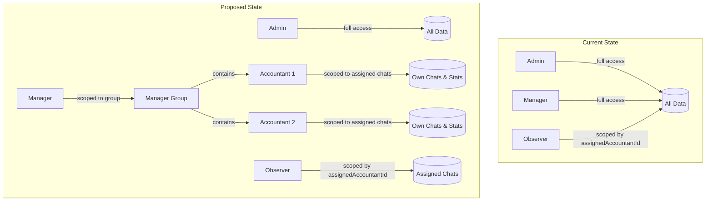

| Change Area              | Summary                                                                      |
| ------------------------ | ---------------------------------------------------------------------------- |
| **Role Enum**            | Add `accountant` to `UserRole` enum and API validation schemas               |
| **Manager-Group Model**  | New `UserManager` join table (M:N) linking accountants to managers            |
| **User Model**           | Add `isActive: Boolean` flag for soft-deactivation                           |
| **Authorization**        | New `accountantProcedure` middleware; update `requireChatAccess()` for accountants |
| **Manager Scoping**      | All manager-level queries filtered by `UserManager` group membership         |
| **Telegram Verification**| New bot flow: confirmation link → identity verification → account activation |
| **Bot Commands**         | New inline buttons for accountants: chat registration, invitation links      |
| **Notifications**        | Define accountant notification types and preference hierarchy                |
| **API Procedures**       | New endpoints for accountant stats; modified endpoints for manager scoping   |

---

## 7. Detailed Requirements

### 7.1 New Role: Accountant (Бухгалтер)

#### 7.1.1 Role Definition

| Attribute          | Value                                                                 |
| ------------------ | --------------------------------------------------------------------- |
| **Role value**     | `accountant`                                                          |
| **Display name**   | Бухгалтер / Accountant                                               |
| **Access level**   | Read-only (MVP)                                                       |
| **Primary interface** | Telegram bot (web dashboard access deferred)                       |
| **Data scope**     | Own assigned chats and personal statistics only                       |

#### 7.1.2 Permissions (MVP — Read-Only)

The accountant can **view** the following data, scoped exclusively to their own assigned chats:

| Resource                  | Access  | Scope                                    | Notes                                     |
| ------------------------- | ------- | ---------------------------------------- | ----------------------------------------- |
| Personal statistics       | ✅ Read | Own data only                            | Response times, active chats, requests handled |
| SLA compliance metrics    | ✅ Read | Own assigned chats only                  | Breach count, average response time, compliance % |
| Assigned chat list        | ✅ Read | Chats where `assignedAccountantId = self` or `self ∈ accountantTelegramIds` | Both primary and secondary assignments |
| Chat message threads      | ✅ Read | Assigned chats only                      | Full message history for assigned chats   |
| Analytics dashboards      | ✅ Read | Scoped to own assigned chats             | Aggregated only over own chats            |
| Assigned/active requests  | ✅ Read | Own chats only                           | View status, timestamps, classification   |
| Client feedback           | ❌ None | —                                        | Manager/Admin only — not visible to accountants |
| Other users' data         | ❌ None | —                                        | Cannot see any other accountant's stats   |
| Templates                 | ❌ None | —                                        | Read access deferred to future work       |
| FAQ items                 | ❌ None | —                                        | Read access deferred to future work       |
| Global settings           | ❌ None | —                                        | Admin only                                |
| User management           | ❌ None | —                                        | Admin only                                |
| Error logs                | ❌ None | —                                        | Admin only                                |

#### 7.1.3 Constraints

- **Verification required** — An accountant must complete Telegram verification before accessing any system data or being assigned to chats.
- **Manager binding required** — An accountant must be assigned to at least one manager before being operational.
- **No write operations** — For MVP, accountants cannot modify any data (no status changes, no template usage, no chat settings).
- **Telegram-first** — All accountant interactions happen via Telegram bot; web dashboard access is a future enhancement.

#### 7.1.4 Accountant Lifecycle States

```mermaid
statechart-v2
    [*] --> Created : Admin/Manager creates user
    Created --> PendingVerification : Verification link sent
    PendingVerification --> Active : Telegram identity confirmed
    Active --> Deactivated : Admin/Manager deactivates
    Deactivated --> Active : Admin reactivates
    Active --> [*] : Account deleted (admin only)
```

| State                  | `isActive` | `isOnboardingComplete` | `telegramAccount` | Can Access System |
| ---------------------- | ---------- | ---------------------- | ------------------ | ----------------- |
| Created                | `true`     | `false`                | `null`             | No                |
| Pending Verification   | `true`     | `false`                | `null`             | No                |
| Active                 | `true`     | `true`                 | exists             | Yes               |
| Deactivated            | `false`    | `true`                 | exists             | No                |

---

### 7.2 Manager-Group Model

#### 7.2.1 Relationship Design

The manager-accountant relationship is **many-to-many (M:N)**:
- An accountant can belong to **multiple** managers simultaneously.
- A manager can have **many** accountants in their group.

This is implemented via a `UserManager` join table.

#### 7.2.2 Data Model

```prisma
/// Join table: many-to-many relationship between managers and their accountants
model UserManager {
  id         String   @id @default(dbgenerated("gen_random_uuid()")) @db.Uuid
  managerId  String   @map("manager_id") @db.Uuid
  userId     String   @map("user_id") @db.Uuid   // The accountant
  assignedAt DateTime @default(now()) @map("assigned_at") @db.Timestamptz(6)
  assignedBy String   @map("assigned_by") @db.Uuid // Who created this binding

  // Relations
  manager    User @relation("ManagedBy", fields: [managerId], references: [id], onDelete: Cascade)
  user       User @relation("Manages", fields: [userId], references: [id], onDelete: Cascade)
  assigner   User @relation("AssignedByUser", fields: [assignedBy], references: [id])

  @@unique([managerId, userId], name: "unique_manager_user")
  @@index([managerId])
  @@index([userId])
  @@map("user_managers")
  @@schema("public")
}
```

#### 7.2.3 Assignment Rules

| Scenario                              | Behavior                                                                  |
| ------------------------------------- | ------------------------------------------------------------------------- |
| Admin creates accountant              | Admin **must** select one or more managers during creation                 |
| Manager creates accountant            | Accountant is **automatically** bound to that manager                     |
| Admin assigns accountant to manager   | Creates `UserManager` record; accountant notified                         |
| Manager unassigns accountant          | Manager can only remove from **own** group; admin can remove from any     |
| Accountant has zero managers          | System should **warn** — accountant is effectively orphaned               |

#### 7.2.4 SLA Escalation Routing

When an SLA breach occurs for a chat assigned to an accountant:

1. **Level 1**: Notify the accountant (Telegram)
2. **Level 2+**: Notify **all managers** bound to the accountant via `UserManager` (Telegram)
3. **Fallback**: If no managers are bound, fall back to `globalManagerIds` from [`GlobalSettings`](backend/prisma/schema.prisma:567)

This replaces the current behavior where escalation goes to `managerTelegramIds[]` on the Chat or `globalManagerIds` globally.

#### 7.2.5 Integrity Constraints

- A `UserManager` record must reference a user with `role = 'manager'` as `managerId`.
- A `UserManager` record must reference a user with `role = 'accountant'` (or `observer`) as `userId`.
- Deleting a User cascades to delete their `UserManager` records.
- The `assignedBy` field provides an audit trail of who created each binding.

---

### 7.3 Manager Scoping

#### 7.3.1 Overview

**Current behavior**: Managers have the same data visibility as Admins — they can see all chats, all analytics, all requests across the entire system.

**Proposed behavior**: Managers see **only** data related to their own group of accountants (i.e., users linked via `UserManager`).

This is a **non-breaking** change in terms of semver (system is pre-1.0) but represents a significant query-level modification across multiple routers.

#### 7.3.2 Scoping Logic

For any manager-level query, the system applies the following filter:

```typescript
// Pseudo-code for manager scoping
function getManagerScope(managerId: string): Prisma.ChatWhereInput {
  return {
    OR: [
      // Chats assigned to accountants in this manager's group
      {
        assignedAccountantId: {
          in: await getGroupUserIds(managerId),
        },
      },
      // Chats where the manager is directly assigned
      {
        assignedAccountantId: managerId,
      },
    ],
  };
}

async function getGroupUserIds(managerId: string): Promise<string[]> {
  const bindings = await prisma.userManager.findMany({
    where: { managerId },
    select: { userId: true },
  });
  return bindings.map((b) => b.userId);
}
```

#### 7.3.3 Affected Routers

| Router                                                                    | Current Behavior            | Proposed Change                                                  |
| ------------------------------------------------------------------------- | --------------------------- | ---------------------------------------------------------------- |
| [`chats`](backend/src/api/trpc/routers/chats.ts)                         | Manager sees all chats      | Filter by `assignedAccountantId IN (group user IDs)`             |
| [`analytics`](backend/src/api/trpc/routers/analytics.ts)                 | Manager sees all analytics  | Aggregate only over chats scoped to group                        |
| [`requests`](backend/src/api/trpc/routers/requests.ts)                   | Manager sees all requests   | Filter by `chatId IN (group chat IDs)`                           |
| [`sla`](backend/src/api/trpc/routers/sla.ts)                             | Manager sees all SLA data  | Filter by group                                                  |
| [`alerts`](backend/src/api/trpc/routers/alerts.ts) / [`alert`](backend/src/api/trpc/routers/alert.ts) | Manager sees all alerts | Filter by group's chats                                    |
| [`feedback`](backend/src/api/trpc/routers/feedback.ts)                   | Manager sees all feedback   | Filter by group                                                  |
| [`messages`](backend/src/api/trpc/routers/messages.ts)                   | Manager sees all messages   | Filter by group's chats                                          |

#### 7.3.4 Admin Override

Admins are **exempt** from scoping — they continue to see all data across all manager groups.

#### 7.3.5 Helper Utility

A reusable helper should be created:

```typescript
// backend/src/api/trpc/helpers/manager-scope.ts

export async function getManagerScopedChatIds(
  prisma: PrismaClient,
  user: AuthUser
): Promise<bigint[] | null> {
  // Admins: no scoping (null = all)
  if (user.role === 'admin') return null;

  // Managers: scope by group
  if (user.role === 'manager') {
    const groupUserIds = await prisma.userManager.findMany({
      where: { managerId: user.id },
      select: { userId: true },
    });
    const userIds = [user.id, ...groupUserIds.map((g) => g.userId)];

    const chats = await prisma.chat.findMany({
      where: { assignedAccountantId: { in: userIds } },
      select: { id: true },
    });
    return chats.map((c) => c.id);
  }

  // Accountants/Observers: scope by assignment
  const chats = await prisma.chat.findMany({
    where: { assignedAccountantId: user.id },
    select: { id: true },
  });
  return chats.map((c) => c.id);
}
```

---

### 7.4 Observer Role (As-Is + Improvement Suggestions)

#### 7.4.1 Current Behavior (Documented As-Is)

| Aspect                  | Current Behavior                                                          |
| ----------------------- | ------------------------------------------------------------------------- |
| **Role value**          | `observer`                                                                |
| **Middleware**           | Passes [`authedProcedure`](backend/src/api/trpc/trpc.ts:161); blocked by `managerProcedure` |
| **Chat access**         | Scoped via [`requireChatAccess()`](backend/src/api/trpc/authorization.ts:28): only chats where `assignedAccountantId === user.id` |
| **Analytics access**    | ⚠️ Currently **NOT scoped** — sees all aggregate data                     |
| **Template/FAQ access** | Read-only (via `authedProcedure`)                                         |
| **Write operations**    | Blocked by `managerProcedure`                                             |
| **User management**     | Blocked by `adminProcedure`                                               |

#### 7.4.2 Gap: Unscoped Analytics

The observer can currently access analytics endpoints that return aggregate data across **all** chats, not just their assigned chats. This is because analytics queries do not call `requireChatAccess()` and operate on aggregate data.

#### 7.4.3 Improvement Suggestions (Future Work)

| Suggestion                          | Description                                                            | Priority |
| ----------------------------------- | ---------------------------------------------------------------------- | -------- |
| **Scope analytics for observers**   | Apply the same chat-level scoping used for chat access to analytics    | Medium   |
| **Anonymized-only mode**            | Allow observers to see analytics without PII (no names, usernames)     | Low      |
| **Observer ↔ Manager binding**      | Extend `UserManager` to also support observer-manager relationships    | Low      |
| **Per-observer dashboard config**   | Let admins configure which analytics widgets observers can see         | Low      |

> **Recommendation**: When implementing manager scoping (§7.3), apply the same scoping logic to observers using their `assignedAccountantId` relationship. This is a low-effort addition.

---

### 7.5 Registration Flow (Options A & B)

Two options are presented for stakeholder discussion. Both options end with the same Telegram verification flow (§7.6).

#### 7.5.1 Option A: Manager Can Create Accountant Accounts

**Flow**: Manager navigates to user management → creates a new user with `role=accountant` → Supabase invitation email is sent → Telegram verification link is sent.

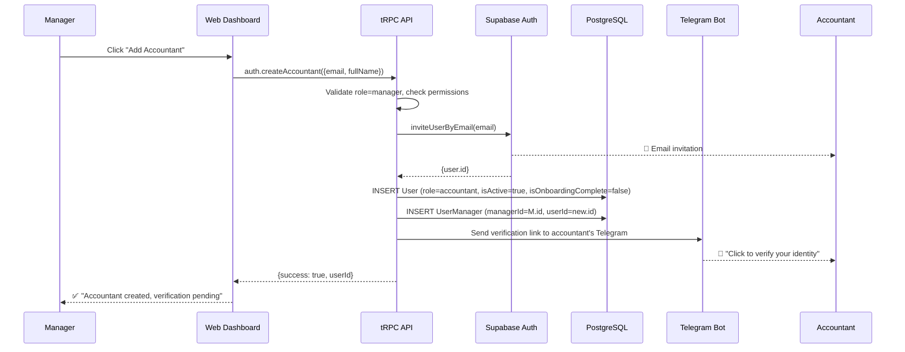

**Pros**:
- Managers can self-serve without Admin involvement
- Faster onboarding — one fewer step in the process
- Manager automatically bound (no manual assignment needed)

**Cons**:
- Managers gain user creation privileges (expanded attack surface)
- Need to restrict: manager can only create `accountant`-role users
- Supabase Auth admin API key usage from manager context requires careful scoping
- Risk of managers creating unauthorized accounts

#### 7.5.2 Option B: Admin Creates Account, Manager Assigns Role

**Flow**: Admin creates user account → Admin or Manager assigns `accountant` role → Admin or Manager assigns accountant to manager group → Telegram verification link is sent.

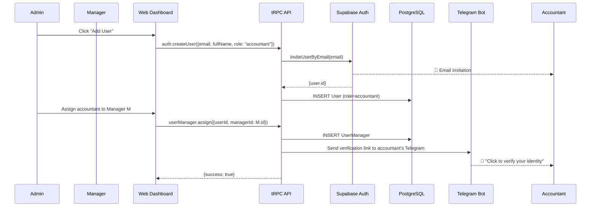

**Pros**:
- Single point of control for user creation (Admin)
- Existing [`auth.createUser`](backend/src/api/trpc/routers/auth.ts:333) already supports this flow
- No new privileges needed for managers
- Lower security risk

**Cons**:
- Admin becomes a bottleneck for onboarding
- More steps in the process
- Manager cannot onboard accountants independently

#### 7.5.3 Comparison Matrix

| Criterion                    | Option A (Manager Creates) | Option B (Admin Creates) |
| ---------------------------- | -------------------------- | ------------------------ |
| Onboarding speed             | ⭐⭐⭐ Fast               | ⭐⭐ Slower              |
| Security                     | ⭐⭐ Moderate              | ⭐⭐⭐ High              |
| Admin bottleneck             | ✅ No                      | ⚠️ Yes                   |
| Implementation complexity    | ⭐⭐ Moderate              | ⭐⭐⭐ Low (reuses existing) |
| Manager independence         | ✅ High                    | ❌ Low                   |
| Audit trail clarity          | ⭐⭐ Good                  | ⭐⭐⭐ Clear              |

> **Recommendation**: Implement **Option B first** (lower risk, reuses existing infrastructure) and add Option A as a follow-up feature with scoped Supabase Admin API access.

---

### 7.6 Telegram Verification Flow

Telegram verification is a **prerequisite** for any system access. No web application is required for this flow — it is entirely Telegram-first.

#### 7.6.1 Flow Description

1. **Admin/Manager creates accountant user** in the web dashboard (via §7.5).
2. **System sends a verification deep link** to the accountant's Telegram:
   - Format: `https://t.me/{botUsername}?start=verify_{token}`
   - Token: UUID v4, stored in a new `VerificationToken` table with expiry.
3. **Accountant clicks the link** in Telegram, opening a chat with the bot.
4. **Bot receives `/start verify_{token}`** and:
   - Validates the token (exists, not expired, not used).
   - Extracts `ctx.from.id` (Telegram user ID) and `ctx.from.username`.
   - Creates/updates `TelegramAccount` record linking `userId` ↔ `telegramId`.
   - Updates `User.telegramId` and `User.telegramUsername`.
   - Sets `User.isOnboardingComplete = true`.
   - Marks the token as used.
5. **Bot confirms success** with a welcome message.
6. **Notifications sent** to associated manager(s) that the accountant has been verified.

#### 7.6.2 Verification Token Model

```prisma
/// Verification tokens for Telegram identity confirmation
model VerificationToken {
  id        String   @id @default(dbgenerated("gen_random_uuid()")) @db.Uuid
  token     String   @unique @default(dbgenerated("gen_random_uuid()"))
  userId    String   @map("user_id") @db.Uuid
  isUsed    Boolean  @default(false) @map("is_used")
  usedAt    DateTime? @map("used_at") @db.Timestamptz(6)
  expiresAt DateTime @map("expires_at") @db.Timestamptz(6)
  createdAt DateTime @default(now()) @map("created_at") @db.Timestamptz(6)

  // Relations
  user User @relation(fields: [userId], references: [id], onDelete: Cascade)

  @@index([token])
  @@index([userId])
  @@map("verification_tokens")
  @@schema("public")
}
```

#### 7.6.3 Sequence Diagram

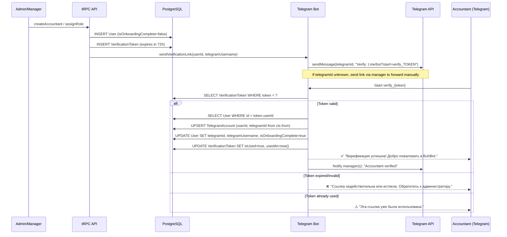

#### 7.6.4 Token Lifecycle

| State     | `isUsed` | `expiresAt`    | System Behavior                |
| --------- | -------- | -------------- | ------------------------------ |
| Active    | `false`  | > now()        | Can be used for verification   |
| Expired   | `false`  | ≤ now()        | Rejected; admin must re-issue  |
| Used      | `true`   | any            | Rejected; verification complete|

- **Default expiry**: 72 hours from creation.
- **Re-issuance**: Admin/Manager can generate a new token at any time (invalidates previous unused tokens for the same user).
- **Cleanup**: Expired tokens should be cleaned up by the existing data retention job ([`data-retention.job.ts`](backend/src/jobs/data-retention.job.ts)).

---

### 7.7 Bot Command Extensions

#### 7.7.1 New Bot Commands for Accountants

These commands are available to verified accountants interacting with the bot in **private chat**:

| Command            | Description                                          | Available to              |
| ------------------ | ---------------------------------------------------- | ------------------------- |
| `/mystats`         | Show personal statistics summary                     | Accountant                |
| `/mychats`         | List assigned chats with SLA status                  | Accountant                |
| `/newchat`         | Create/register a new client chat                    | Accountant, Manager, Admin|
| `/invite`          | Generate an invitation link for a client             | Accountant, Manager, Admin|
| `/notifications`   | View/toggle notification preferences                 | Accountant, Manager, Admin|

#### 7.7.2 Inline Buttons

In addition to slash commands, the bot should provide **inline keyboard buttons** after the `/start` command (for verified users):

```
🏠 Главное меню
├── 📊 Моя статистика (/mystats)
├── 💬 Мои чаты (/mychats)
├── ➕ Новый чат (/newchat)
├── 🔗 Пригласить клиента (/invite)
├── 🔔 Уведомления (/notifications)
└── ❓ Помощь (/help)
```

#### 7.7.3 `/mystats` — Personal Statistics

Returns a formatted Telegram message with:

```
📊 Ваша статистика за последние 30 дней:

👥 Активных чатов: 12
📨 Обработано запросов: 87
⏱ Среднее время ответа: 23 мин
✅ SLA соблюдение: 94.2%
⚠️ Нарушений SLA: 5
🔴 Просроченных запросов: 2

Подробнее → [ссылка на дашборд] (future)
```

#### 7.7.4 `/newchat` — Create New Client Chat

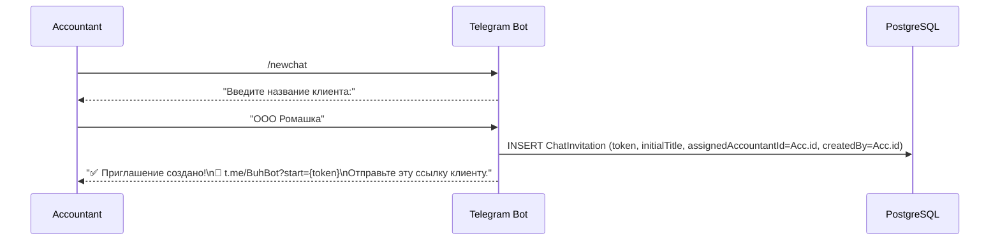

#### 7.7.5 `/invite` — Generate Invitation Link

Similar to `/newchat` but for an existing chat or with more options:

- Select from assigned chats (inline keyboard)
- Generate fresh invitation link
- Set optional expiry time

---

### 7.8 Notification System

#### 7.8.1 Notification Delivery

ALL notifications for accountants are delivered via **Telegram messages**. No in-app (web) notifications are used for accountants in MVP.

#### 7.8.2 Notification Types

| Type                         | Recipient(s)                     | Trigger                                     | Priority |
| ---------------------------- | -------------------------------- | ------------------------------------------- | -------- |
| **SLA Breach Alert**         | Accountant + bound managers      | SLA timer exceeds threshold                 | High     |
| **SLA Warning Alert**        | Accountant                       | SLA timer reaches warning % threshold       | Medium   |
| **New Client Message**       | Accountant (assigned)            | Client sends message in assigned chat       | Medium   |
| **Chat Assignment**          | Accountant                       | Assigned to a new chat                      | Medium   |
| **Chat Unassignment**        | Accountant                       | Removed from a chat                         | Medium   |
| **Manager Assignment**       | Accountant + new manager         | Bound to a new manager group                | Low      |
| **Manager Unassignment**     | Accountant + old manager         | Removed from a manager group                | Low      |
| **Verification Reminder**    | Accountant                       | 24h after unverified account creation       | Medium   |
| **System Announcement**      | All accountants                  | Admin broadcasts                            | Low      |
| **Deactivation Warning**     | Accountant + managers            | Account about to be deactivated             | High     |
| **Reassignment Notice**      | Accountant + old/new manager     | Manager switch (§7.9)                       | Medium   |
| **Daily Summary**            | Accountant (opt-in)              | Daily digest at configurable time           | Low      |
| **Weekly Performance Report**| Accountant (opt-in)              | Weekly summary of stats                     | Low      |

#### 7.8.3 Notification Preferences

Preferences are stored per-user and determine which notification types are enabled/disabled.

```prisma
/// User notification preferences
model NotificationPreference {
  id              String   @id @default(dbgenerated("gen_random_uuid()")) @db.Uuid
  userId          String   @map("user_id") @db.Uuid
  notificationType String  @map("notification_type") // e.g., "sla_breach", "new_message", etc.
  isEnabled       Boolean  @default(true) @map("is_enabled")
  overriddenBy    String?  @map("overridden_by") @db.Uuid // Manager/Admin who forced this setting
  overriddenAt    DateTime? @map("overridden_at") @db.Timestamptz(6)
  updatedAt       DateTime @default(now()) @updatedAt @map("updated_at") @db.Timestamptz(6)

  // Relations
  user User @relation(fields: [userId], references: [id], onDelete: Cascade)

  @@unique([userId, notificationType], name: "unique_user_notification_type")
  @@index([userId])
  @@map("notification_preferences")
  @@schema("public")
}
```

#### 7.8.4 Preference Hierarchy

Notification preferences follow a strict override hierarchy:

```
Admin Override > Manager Override > Accountant Self-Set > System Default (enabled)
```

| Level              | Who sets it        | Can be overridden by | Example                            |
| ------------------ | ------------------ | -------------------- | ---------------------------------- |
| **System Default** | Code               | Anyone               | All notifications enabled          |
| **Accountant**     | Accountant         | Manager, Admin       | Disable "Daily Summary"            |
| **Manager**        | Bound manager      | Admin only           | Force-enable "SLA Breach" for all  |
| **Admin**          | Admin              | No one               | Force-enable "System Announcement" |

When resolving whether to send a notification:

```typescript
function isNotificationEnabled(
  userId: string,
  type: string,
  preferences: NotificationPreference[]
): boolean {
  const pref = preferences.find((p) => p.notificationType === type);
  if (!pref) return true; // System default: enabled

  // If overridden by admin/manager, use the overridden value
  // Accountant's own preference is already stored in isEnabled
  return pref.isEnabled;
}
```

The `overriddenBy` field tracks who last forced a preference value. If a manager sets a preference, the accountant cannot change it back (UI should show it as locked). Only an admin or the same/higher-level manager can unlock it.

---

### 7.9 Reassignment Flow

#### 7.9.1 Definition

Reassignment moves an accountant from one manager's group to another. This is an **admin-only** operation.

#### 7.9.2 Behavior

| Aspect                       | Specification                                                    |
| ---------------------------- | ---------------------------------------------------------------- |
| **Who can perform**          | Admin only                                                       |
| **Transfer period**          | Immediate — no transition period                                 |
| **Chat assignments**         | **Preserved** — existing chat assignments are NOT affected       |
| **Manager group membership** | Old `UserManager` record is deleted; new one is created          |
| **Notifications**            | Sent to: old manager, new manager, and the accountant            |

#### 7.9.3 API Operation

```typescript
// Pseudo-code
async function reassignAccountant(input: {
  accountantId: string;
  fromManagerId: string;
  toManagerId: string;
}) {
  await prisma.$transaction(async (tx) => {
    // 1. Validate all users exist and have correct roles
    // 2. Remove old binding
    await tx.userManager.delete({
      where: { managerId_userId: { managerId: input.fromManagerId, userId: input.accountantId } },
    });
    // 3. Create new binding
    await tx.userManager.create({
      data: { managerId: input.toManagerId, userId: input.accountantId, assignedBy: adminId },
    });
    // 4. Send notifications to all three parties
  });
}
```

#### 7.9.4 Sequence Diagram

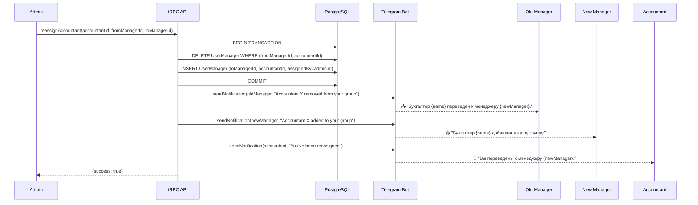

---

### 7.10 Deactivation Flow

#### 7.10.1 Definition

Deactivation sets `isActive: false` on a user, preventing login and system access while preserving the account and all historical data.

#### 7.10.2 Prerequisites

**Before deactivating an accountant**, the system **must enforce** that all affected chats have a replacement accountant assigned:

1. Query all chats where `assignedAccountantId = accountant.id`.
2. If any chats are found, **block the deactivation** and return the list of affected chats.
3. Admin/Manager must first reassign a replacement accountant to each affected chat.
4. Only after all chats have replacement assignments can deactivation proceed.

#### 7.10.3 Deactivation Steps

| Step | Action                                                                    |
| ---- | ------------------------------------------------------------------------- |
| 1    | **Prerequisite check**: All assigned chats must have replacement accountant |
| 2    | Set `User.isActive = false`                                               |
| 3    | Remove user from `accountantUsernames[]` and `accountantTelegramIds[]` on all chats |
| 4    | Set `assignedAccountantId = null` on chats (should already be reassigned per prerequisite) |
| 5    | Retain `UserManager` records (for audit trail)                            |
| 6    | Notify all bound managers: "Accountant {name} has been deactivated"       |
| 7    | Notify accountant: "Your account has been deactivated"                    |
| 8    | Invalidate active Supabase sessions (if any)                              |

#### 7.10.4 Sequence Diagram

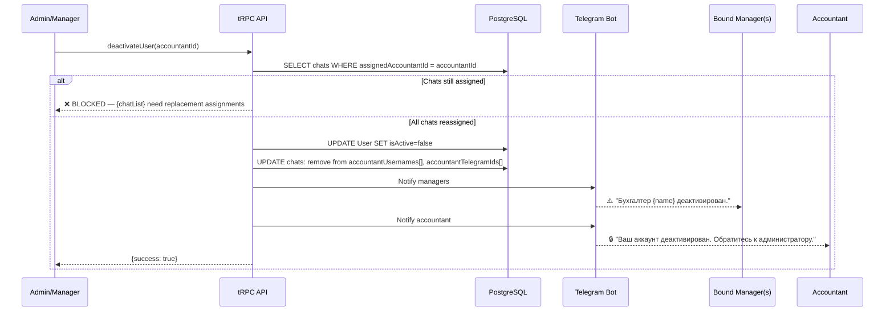

#### 7.10.5 Reactivation

- **Admin-only** operation.
- Sets `isActive = true`.
- Accountant may need re-verification if `TelegramAccount` was removed.
- Does NOT automatically restore previous chat assignments.

---

### 7.11 Manager Cascade Logic

#### 7.11.1 Problem

When a manager is deactivated or deleted, their accountants may become "orphaned" — left without any active manager. This must be prevented.

#### 7.11.2 Cascade Check Algorithm

Before deactivating/deleting a manager:

```
1. Get all accountants in the manager's group:
   accountants = SELECT userId FROM UserManager WHERE managerId = targetManagerId

2. For each accountant:
   otherActiveManagers = SELECT COUNT(*) FROM UserManager um
     JOIN users u ON um.managerId = u.id
     WHERE um.userId = accountant.id
       AND um.managerId != targetManagerId
       AND u.isActive = true

3. If ANY accountant has otherActiveManagers = 0:
   BLOCK the operation
   Return list of orphan-risk accountants
```

#### 7.11.3 Behavior

| Scenario                                      | System Response                                                |
| --------------------------------------------- | -------------------------------------------------------------- |
| All accountants have other active managers     | ✅ Proceed with deactivation                                   |
| Some accountants would be orphaned             | ❌ Block operation; return orphan-risk accountant list          |
| Manager has no accountants                     | ✅ Proceed with deactivation immediately                       |
| Admin trying to deactivate themselves          | ❌ Block (self-deactivation not allowed — existing behavior)   |

#### 7.11.4 Sequence Diagram

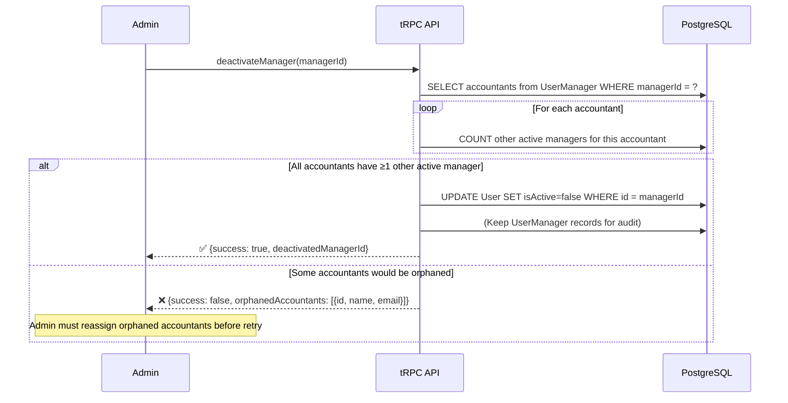

#### 7.11.5 Resolution Steps (When Blocked)

1. Admin reviews the list of orphan-risk accountants.
2. For each orphan-risk accountant, Admin assigns them to another active manager.
3. Admin retries the manager deactivation.
4. System re-runs the cascade check.
5. If all clear, deactivation proceeds.

---

## 8. Role-Based Access Control Matrix

This comprehensive matrix defines access for all 4 roles across all system resources.

**Legend**:
- ✅ Full access
- 📖 Read-only
- 🔒 Scoped (filtered by assignment/group)
- ❌ No access
- 🔧 Admin override possible

### 8.1 Data Resources

| Resource                    | Admin          | Manager              | Accountant           | Observer             |
| --------------------------- | -------------- | -------------------- | -------------------- | -------------------- |
| **All Chats (list)**        | ✅ All         | 🔒 Group-scoped      | 🔒 Assigned only     | 🔒 Assigned only     |
| **Chat Details**            | ✅ Any         | 🔒 Group chats       | 🔒 Assigned chats    | 🔒 Assigned chats    |
| **Chat Settings (update)**  | ✅             | ✅ Group chats       | ❌                   | ❌                   |
| **Chat Assignment**         | ✅             | ✅ Group chats       | ❌                   | ❌                   |
| **Chat Messages**           | ✅ All         | 🔒 Group chats       | 🔒 Assigned chats    | 🔒 Assigned chats    |
| **Client Requests (list)**  | ✅ All         | 🔒 Group-scoped      | 🔒 Own chats         | 🔒 Assigned chats    |
| **Request Status (update)** | ✅             | ✅ Group requests    | ❌                   | ❌                   |
| **SLA Alerts (list)**       | ✅ All         | 🔒 Group-scoped      | 🔒 Own chats         | 🔒 Assigned chats    |
| **SLA Alert (resolve)**     | ✅             | ✅ Group alerts      | ❌                   | ❌                   |
| **Analytics Dashboards**    | ✅ All data    | 🔒 Group-scoped      | 🔒 Own stats only    | 📖 All (⚠️ unscoped) |
| **Personal Statistics**     | ✅ Any user    | 🔒 Group users       | 🔒 Own only          | ❌                   |
| **Client Feedback**         | ✅ All         | 🔒 Group-scoped      | ❌                   | ❌                   |
| **Surveys**                 | ✅ All         | ✅ Create/manage     | ❌                   | ❌                   |

### 8.2 Configuration & Management

| Resource                    | Admin          | Manager              | Accountant           | Observer             |
| --------------------------- | -------------- | -------------------- | -------------------- | -------------------- |
| **Global Settings**         | ✅ Read/Write  | 📖 Read-only         | ❌                   | ❌                   |
| **Working Schedules**       | ✅ CRUD        | ✅ Group chats       | ❌                   | ❌                   |
| **Holidays (Global)**       | ✅ CRUD        | 📖 Read-only         | ❌                   | ❌                   |
| **Holidays (Chat)**         | ✅ CRUD        | ✅ Group chats       | ❌                   | ❌                   |
| **Templates**               | ✅ CRUD        | ✅ Create/Update     | ❌                   | 📖 Read-only         |
| **FAQ Items**               | ✅ CRUD        | ✅ Create/Update     | ❌                   | 📖 Read-only         |
| **User Management**         | ✅ Full CRUD   | 🔒 Create accountants (Option A) | ❌     | ❌                   |
| **Role Assignment**         | ✅             | ❌                   | ❌                   | ❌                   |
| **Manager Group Mgmt**      | ✅ All groups  | 🔒 Own group         | ❌                   | ❌                   |
| **Error Logs**              | ✅ Full        | ❌                   | ❌                   | ❌                   |
| **Contact Requests**        | ✅ Full        | ❌                   | ❌                   | ❌                   |

### 8.3 Notification Management

| Resource                    | Admin          | Manager              | Accountant           | Observer             |
| --------------------------- | -------------- | -------------------- | -------------------- | -------------------- |
| **Own Preferences (view)**  | ✅             | ✅                   | ✅                   | ✅                   |
| **Own Preferences (edit)**  | ✅             | ✅                   | ✅ (unless locked)   | ✅                   |
| **Others' Preferences**     | ✅ Any user    | 🔒 Group accountants | ❌                   | ❌                   |
| **Override Preferences**    | ✅ Any user    | 🔒 Group accountants | ❌                   | ❌                   |
| **System Announcements**    | ✅ Send        | ❌                   | ❌                   | ❌                   |

### 8.4 Bot Commands

| Command                     | Admin          | Manager              | Accountant           | Observer             |
| --------------------------- | -------------- | -------------------- | -------------------- | -------------------- |
| `/start`                    | ✅             | ✅                   | ✅                   | ✅                   |
| `/help`                     | ✅             | ✅                   | ✅                   | ✅                   |
| `/menu`                     | ✅             | ✅                   | ✅                   | ✅                   |
| `/connect <token>`          | ✅             | ✅                   | ✅                   | ❌                   |
| `/mystats`                  | ✅             | ✅                   | ✅                   | ❌                   |
| `/mychats`                  | ✅             | ✅                   | ✅                   | ❌                   |
| `/newchat`                  | ✅             | ✅                   | ✅                   | ❌                   |
| `/invite`                   | ✅             | ✅                   | ✅                   | ❌                   |
| `/notifications`            | ✅             | ✅                   | ✅                   | ❌                   |
| `/diagnose`                 | ✅             | ✅                   | ❌                   | ❌                   |
| Alert inline buttons        | ✅             | ✅                   | ❌ (MVP)             | ❌                   |
| Survey inline buttons       | ❌             | ❌                   | ❌                   | ❌ (client-facing)   |

---

## 9. Data Model Changes

### 9.1 Prisma Schema Diff (Conceptual)

#### 9.1.1 Enum Change: `UserRole`

```diff
 enum UserRole {
   admin
   manager
+  accountant
   observer

   @@schema("public")
 }
```

#### 9.1.2 Model Change: `User`

```diff
 model User {
   id               String   @id @db.Uuid
   email            String   @unique
   fullName         String   @map("full_name")
   role             String   @default("observer")
   telegramId       BigInt?  @map("telegram_id") @db.BigInt
   telegramUsername String?  @map("telegram_username")
+  isActive         Boolean  @default(true) @map("is_active")
   createdAt        DateTime @default(now()) @map("created_at") @db.Timestamptz(6)
   updatedAt        DateTime @default(now()) @updatedAt @map("updated_at") @db.Timestamptz(6)

   isOnboardingComplete Boolean @default(false) @map("is_onboarding_complete")

   // Relations
   assignedChats      Chat[]           @relation("AssignedAccountant")
   assignedRequests   ClientRequest[]  @relation("AssignedTo")
   acknowledgedAlerts SlaAlert[]       @relation("AcknowledgedBy")
   createdTemplates   Template[]       @relation("TemplateCreator")
   createdFaqItems    FaqItem[]        @relation("FaqCreator")
   closedSurveys      FeedbackSurvey[] @relation("SurveyClosedBy")
   notifications      Notification[]
   createdInvitations ChatInvitation[] @relation("InvitationCreator")
   telegramAccount    TelegramAccount?
   assignedErrors     ErrorLog[]       @relation("ErrorLogAssignee")
   classificationCorrections ClassificationCorrection[]
+  managedUsers       UserManager[]    @relation("ManagedBy")   // If this user is a manager
+  managers           UserManager[]    @relation("Manages")     // If this user is an accountant
+  verificationTokens VerificationToken[]
+  notificationPreferences NotificationPreference[]

+  @@index([isActive])
   @@index([email])
   @@index([role])
   @@map("users")
   @@schema("public")
 }
```

#### 9.1.3 New Model: `UserManager`

```prisma
/// Join table: M:N relationship between managers and accountants
model UserManager {
  id         String   @id @default(dbgenerated("gen_random_uuid()")) @db.Uuid
  managerId  String   @map("manager_id") @db.Uuid
  userId     String   @map("user_id") @db.Uuid
  assignedAt DateTime @default(now()) @map("assigned_at") @db.Timestamptz(6)
  assignedBy String   @map("assigned_by") @db.Uuid

  manager    User @relation("ManagedBy", fields: [managerId], references: [id], onDelete: Cascade)
  user       User @relation("Manages", fields: [userId], references: [id], onDelete: Cascade)

  @@unique([managerId, userId], name: "unique_manager_user")
  @@index([managerId])
  @@index([userId])
  @@map("user_managers")
  @@schema("public")
}
```

#### 9.1.4 New Model: `VerificationToken`

```prisma
/// Verification tokens for Telegram identity confirmation
model VerificationToken {
  id        String    @id @default(dbgenerated("gen_random_uuid()")) @db.Uuid
  token     String    @unique @default(dbgenerated("gen_random_uuid()"))
  userId    String    @map("user_id") @db.Uuid
  isUsed    Boolean   @default(false) @map("is_used")
  usedAt    DateTime? @map("used_at") @db.Timestamptz(6)
  expiresAt DateTime  @map("expires_at") @db.Timestamptz(6)
  createdAt DateTime  @default(now()) @map("created_at") @db.Timestamptz(6)

  user User @relation(fields: [userId], references: [id], onDelete: Cascade)

  @@index([token])
  @@index([userId])
  @@map("verification_tokens")
  @@schema("public")
}
```

#### 9.1.5 New Model: `NotificationPreference`

```prisma
/// User notification preferences with hierarchy support
model NotificationPreference {
  id               String    @id @default(dbgenerated("gen_random_uuid()")) @db.Uuid
  userId           String    @map("user_id") @db.Uuid
  notificationType String    @map("notification_type")
  isEnabled        Boolean   @default(true) @map("is_enabled")
  overriddenBy     String?   @map("overridden_by") @db.Uuid
  overriddenAt     DateTime? @map("overridden_at") @db.Timestamptz(6)
  updatedAt        DateTime  @default(now()) @updatedAt @map("updated_at") @db.Timestamptz(6)

  user User @relation(fields: [userId], references: [id], onDelete: Cascade)

  @@unique([userId, notificationType], name: "unique_user_notification_type")
  @@index([userId])
  @@map("notification_preferences")
  @@schema("public")
}
```

### 9.2 Migration Summary

| Migration                         | Type         | Reversible | Notes                                      |
| --------------------------------- | ------------ | ---------- | ------------------------------------------ |
| Add `accountant` to `UserRole`    | ALTER TYPE   | Yes        | PostgreSQL enum ALTER TYPE ADD VALUE        |
| Add `isActive` to `users`         | ALTER TABLE  | Yes        | Default `true`, no data migration needed   |
| Create `user_managers` table      | CREATE TABLE | Yes        | New join table                              |
| Create `verification_tokens`      | CREATE TABLE | Yes        | New table                                   |
| Create `notification_preferences` | CREATE TABLE | Yes        | New table                                   |
| Add indexes on `users.is_active`  | CREATE INDEX | Yes        | Performance optimization                    |

---

## 10. API Changes

### 10.1 New tRPC Procedures

#### 10.1.1 Accountant Statistics

| Procedure                          | Type    | Auth Level        | Description                                     |
| ---------------------------------- | ------- | ----------------- | ----------------------------------------------- |
| `accountant.myStats`               | Query   | `authedProcedure` | Get personal statistics for authenticated user  |
| `accountant.myChats`               | Query   | `authedProcedure` | List chats assigned to authenticated user       |
| `accountant.mySlaCompliance`       | Query   | `authedProcedure` | SLA compliance metrics for own chats            |
| `accountant.myActiveRequests`      | Query   | `authedProcedure` | List active (unresolved) requests in own chats  |

#### 10.1.2 Manager-Group Management

| Procedure                          | Type     | Auth Level           | Description                                     |
| ---------------------------------- | -------- | -------------------- | ----------------------------------------------- |
| `userManager.assign`               | Mutation | `adminProcedure`     | Bind accountant to manager                      |
| `userManager.unassign`             | Mutation | `managerProcedure`   | Remove accountant from group (own group only)   |
| `userManager.reassign`             | Mutation | `adminProcedure`     | Move accountant between managers (§7.9)         |
| `userManager.listByManager`        | Query    | `managerProcedure`   | List accountants in a manager's group           |
| `userManager.listByAccountant`     | Query    | `authedProcedure`    | List managers for an accountant                 |

#### 10.1.3 Verification

| Procedure                          | Type     | Auth Level           | Description                                     |
| ---------------------------------- | -------- | -------------------- | ----------------------------------------------- |
| `verification.create`              | Mutation | `managerProcedure`   | Generate verification token for accountant      |
| `verification.resend`              | Mutation | `managerProcedure`   | Regenerate and resend verification link          |
| `verification.status`              | Query    | `managerProcedure`   | Check verification status for a user            |

#### 10.1.4 Notification Preferences

| Procedure                          | Type     | Auth Level           | Description                                     |
| ---------------------------------- | -------- | -------------------- | ----------------------------------------------- |
| `notificationPref.get`             | Query    | `authedProcedure`    | Get own notification preferences                |
| `notificationPref.update`          | Mutation | `authedProcedure`    | Update own notification preferences             |
| `notificationPref.override`        | Mutation | `managerProcedure`   | Override accountant's notification preferences   |
| `notificationPref.adminOverride`   | Mutation | `adminProcedure`     | Override any user's notification preferences     |

#### 10.1.5 Deactivation

| Procedure                          | Type     | Auth Level           | Description                                     |
| ---------------------------------- | -------- | -------------------- | ----------------------------------------------- |
| `auth.deactivateUser`              | Mutation | `managerProcedure`   | Deactivate user (with prerequisite check)        |
| `auth.reactivateUser`              | Mutation | `adminProcedure`     | Reactivate deactivated user                      |

### 10.2 Modified tRPC Procedures

#### 10.2.1 Role Schema Updates

All procedures that validate user roles must be updated:

```diff
- const UserRoleSchema = z.enum(['admin', 'manager', 'observer']);
+ const UserRoleSchema = z.enum(['admin', 'manager', 'accountant', 'observer']);
```

**Affected files**:
- [`backend/src/api/trpc/routers/auth.ts:21`](backend/src/api/trpc/routers/auth.ts:21) — `UserRoleSchema`
- [`backend/src/api/trpc/routers/user.ts:147`](backend/src/api/trpc/routers/user.ts:147) — `user.list` role filter
- [`backend/src/api/trpc/authorization.ts:12`](backend/src/api/trpc/authorization.ts:12) — `AuthUser` interface

#### 10.2.2 Authorization Middleware Changes

**New middleware**: `accountantProcedure`

```typescript
const isAccountantOrAbove = t.middleware(({ ctx, next }) => {
  if (!ctx.user) {
    throw new TRPCError({ code: 'UNAUTHORIZED', ... });
  }
  if (!['admin', 'manager', 'accountant'].includes(ctx.user.role)) {
    throw new TRPCError({ code: 'FORBIDDEN', ... });
  }
  return next({ ctx: { ...ctx, user: ctx.user } });
});

export const accountantProcedure = publicProcedure.use(isAccountantOrAbove);
```

**Updated**: [`requireChatAccess()`](backend/src/api/trpc/authorization.ts:28)

```diff
 interface AuthUser {
-  role: 'admin' | 'manager' | 'observer';
+  role: 'admin' | 'manager' | 'accountant' | 'observer';
 }

 export function requireChatAccess(user: AuthUser, chat: ChatLike): void {
   if (['admin', 'manager'].includes(user.role)) {
-    return;
+    return; // Admin: full access; Manager: caller must pre-filter by group scope
   }
+  // Accountant and Observer: only assigned chats
   if (chat.assignedAccountantId !== user.id) {
     throw new TRPCError({ code: 'FORBIDDEN', ... });
   }
 }
```

#### 10.2.3 Manager-Scoped Query Changes

All following routers need query-level scoping for manager role users. The pattern:

```typescript
// Before (existing)
const chats = await ctx.prisma.chat.findMany({ where: { ... } });

// After (with manager scoping)
const scopedChatIds = await getManagerScopedChatIds(ctx.prisma, ctx.user);
const chats = await ctx.prisma.chat.findMany({
  where: {
    ...existingFilters,
    ...(scopedChatIds !== null ? { id: { in: scopedChatIds } } : {}),
  },
});
```

**Routers requiring this pattern**:

| Router                                                                    | Procedures affected                                           |
| ------------------------------------------------------------------------- | ------------------------------------------------------------- |
| [`chats`](backend/src/api/trpc/routers/chats.ts)                         | `list`, `getById`                                             |
| [`analytics`](backend/src/api/trpc/routers/analytics.ts)                 | `slaCompliance`, `feedbackSummary`, `accountantPerformance`   |
| [`requests`](backend/src/api/trpc/routers/requests.ts)                   | `list`, `getById`                                             |
| [`alerts`](backend/src/api/trpc/routers/alerts.ts)                       | `listUnacknowledged`                                          |
| [`alert`](backend/src/api/trpc/routers/alert.ts)                         | `getAlerts`, `getActiveAlerts`, `getAlertStats`               |
| [`sla`](backend/src/api/trpc/routers/sla.ts)                             | `getRequests`, `getActiveTimers`                              |
| [`feedback`](backend/src/api/trpc/routers/feedback.ts)                   | `getAggregates`, `getAll`, `exportCsv`                        |
| [`messages`](backend/src/api/trpc/routers/messages.ts)                   | `listByChat`                                                  |

#### 10.2.4 User Creation Changes

[`auth.createUser`](backend/src/api/trpc/routers/auth.ts:333) needs to accept the new `accountant` role and optionally accept `managerIds`:

```diff
 createUser: adminProcedure
   .input(z.object({
     email: z.string().email(),
     fullName: z.string().min(1),
-    role: UserRoleSchema,
+    role: UserRoleSchema,
+    managerIds: z.array(z.string().uuid()).optional(), // Required when role=accountant
   }))
```

### 10.3 New tRPC Router: `accountant`

```typescript
// backend/src/api/trpc/routers/accountant.ts

export const accountantRouter = router({
  myStats: authedProcedure.query(async ({ ctx }) => { /* ... */ }),
  myChats: authedProcedure.query(async ({ ctx }) => { /* ... */ }),
  mySlaCompliance: authedProcedure.query(async ({ ctx }) => { /* ... */ }),
  myActiveRequests: authedProcedure.query(async ({ ctx }) => { /* ... */ }),
});
```

### 10.4 New tRPC Router: `userManager`

```typescript
// backend/src/api/trpc/routers/user-manager.ts

export const userManagerRouter = router({
  assign: adminProcedure.input(z.object({ ... })).mutation(async ({ ctx, input }) => { /* ... */ }),
  unassign: managerProcedure.input(z.object({ ... })).mutation(async ({ ctx, input }) => { /* ... */ }),
  reassign: adminProcedure.input(z.object({ ... })).mutation(async ({ ctx, input }) => { /* ... */ }),
  listByManager: managerProcedure.input(z.object({ ... })).query(async ({ ctx, input }) => { /* ... */ }),
  listByAccountant: authedProcedure.input(z.object({ ... })).query(async ({ ctx, input }) => { /* ... */ }),
});
```

---

## 11. Bot Command Changes

### 11.1 Handler Registration Order Update

The current handler registration order in [`backend/src/bot/handlers/index.ts`](backend/src/bot/handlers/index.ts) will be extended:

```diff
 export { registerFaqHandler } from './faq.handler.js';
 export { registerMessageHandler } from './message.handler.js';
 export { registerResponseHandler } from './response.handler.js';
 export { registerAlertCallbackHandler } from './alert-callback.handler.js';
 export { registerSurveyHandler, isAwaitingComment, getAwaitingCommentData } from './survey.handler.js';
 export { registerMenuHandler } from './menu.handler.js';
 export { registerFileHandler, formatFileSize, formatTimestamp } from './file.handler.js';
 export { registerTemplateHandler } from './template.handler.js';
+export { registerAccountantHandler } from './accountant.handler.js';
+export { registerVerificationHandler } from './verification.handler.js';
```

### 11.2 New Handler: `accountant.handler.ts`

Responsible for:
- `/mystats` command
- `/mychats` command
- `/newchat` command flow
- `/invite` command flow
- `/notifications` command

### 11.3 New Handler: `verification.handler.ts`

Responsible for:
- Processing `/start verify_{token}` deep links
- Token validation and user activation
- Sending verification confirmation

### 11.4 Modified Handler: `invitation.handler.ts`

[`invitation.handler.ts`](backend/src/bot/handlers/invitation.handler.ts) currently handles `/start <token>` for chat invitations. It needs to be updated to:

1. **Distinguish** between invitation tokens and verification tokens:
   - Verification tokens: `/start verify_{uuid}`
   - Invitation tokens: `/start {alphanumeric}`
2. Route `verify_*` tokens to the verification handler.
3. Route all other tokens to the existing invitation handler.

### 11.5 Bot User Identity Resolution

When the bot receives a message, it needs to determine the user's role. The current system identifies accountants by matching `ctx.from.id` against `Chat.accountantTelegramIds[]`. With the new role, the bot should also:

1. Look up `User` by `telegramId = ctx.from.id`.
2. Check `User.role` and `User.isActive`.
3. Apply role-based command filtering.

---

## 12. Edge Cases

### 12.1 Account & Identity

| #   | Edge Case                                           | Expected Behavior                                                      |
| --- | --------------------------------------------------- | ---------------------------------------------------------------------- |
| EC-01 | Accountant clicks a verification link that has expired | Bot replies: "Ссылка недействительна или истекла." Admin must regenerate. |
| EC-02 | Accountant clicks a verification link already used  | Bot replies: "Эта ссылка уже была использована."                       |
| EC-03 | Telegram user ID from verification doesn't match the expected username | Proceed (Telegram ID is authoritative; username can change). Log the mismatch. |
| EC-04 | Accountant already verified, clicks verification link again | Idempotent: update `TelegramAccount` if changed, reply "Вы уже верифицированы." |
| EC-05 | Two different users try to verify with the same Telegram account | Second verification fails with "Этот Telegram аккаунт уже привязан к другому пользователю." |
| EC-06 | Accountant's Telegram username changes after verification | No impact — system uses `telegramId` (immutable) as primary identifier. Update `username` on next interaction. |
| EC-07 | Deactivated accountant tries to use bot commands    | Bot replies: "Ваш аккаунт деактивирован. Обратитесь к администратору." |
| EC-08 | Unverified accountant tries to use bot commands     | Bot replies: "Пожалуйста, завершите верификацию." with re-send option. |

### 12.2 Manager-Group Relationships

| #   | Edge Case                                           | Expected Behavior                                                      |
| --- | --------------------------------------------------- | ---------------------------------------------------------------------- |
| EC-09 | Accountant assigned to zero managers                | System warning to admin. Accountant can still function but SLA escalation falls back to `globalManagerIds`. |
| EC-10 | Manager tries to remove an accountant that also belongs to another manager | Allowed — only removes from the requesting manager's group.   |
| EC-11 | Admin assigns a manager to another manager's group  | Allowed — managers can technically be in another manager's group (for hierarchical structures). |
| EC-12 | Circular manager-accountant relationship (A manages B, B manages A) | Should be **blocked** at API level. Validate that `userId ≠ managerId` and check for cycles. |
| EC-13 | Manager creates an accountant (Option A) while already at max group size | No limit enforced in this PRD. Future work for group size limits. |

### 12.3 Chat Assignment

| #   | Edge Case                                           | Expected Behavior                                                      |
| --- | --------------------------------------------------- | ---------------------------------------------------------------------- |
| EC-14 | Admin/Manager assigned as `assignedAccountantId`    | Allowed — `assignedAccountantId` is not restricted to accountant-role users. |
| EC-15 | Chat has `accountantUsernames` but no `assignedAccountantId` | `accountantUsernames` still used for notification routing. `assignedAccountantId` is optional. |
| EC-16 | Accountant assigned to a chat before verification   | **Blocked** — system must check `isOnboardingComplete = true` before assignment. |
| EC-17 | Accountant assigned to 100+ chats                   | Allowed — no per-accountant chat limit in this PRD. Future work.       |
| EC-18 | Deactivated accountant is still `assignedAccountantId` on a chat | Deactivation flow (§7.10) removes all assignments before deactivation. |

### 12.4 Notifications

| #   | Edge Case                                           | Expected Behavior                                                      |
| --- | --------------------------------------------------- | ---------------------------------------------------------------------- |
| EC-19 | Manager overrides accountant's notification preference, then accountant tries to change it | UI shows preference as "locked by manager." Accountant cannot change. |
| EC-20 | Admin overrides a preference already overridden by manager | Admin override takes precedence. `overriddenBy` updated to admin's ID. |
| EC-21 | Notification sent to deactivated accountant         | Skip sending. Log the skip. Do NOT queue for retry.                    |
| EC-22 | Accountant blocks the bot on Telegram               | Delivery fails with 403. Mark `deliveryStatus = failed`. Alert manager. |
| EC-23 | SLA breach for a chat where the accountant has no bound managers | Fall back to `globalManagerIds` from `GlobalSettings`. Log the orphan scenario. |

### 12.5 Deactivation & Cascade

| #   | Edge Case                                           | Expected Behavior                                                      |
| --- | --------------------------------------------------- | ---------------------------------------------------------------------- |
| EC-24 | Admin tries to deactivate the last remaining admin  | **Blocked** — same as existing delete protection.                      |
| EC-25 | Manager deactivated while having pending SLA alerts | Alerts reassigned to `globalManagerIds`. Active alerts remain active.   |
| EC-26 | Accountant reactivated after 6 months               | Account is active but may need re-verification. Chat assignments are NOT auto-restored. |
| EC-27 | Manager deactivation cascade check: accountant has 2 managers, one is already deactivated | Only count **active** managers. If the other is inactive, accountant is orphan-risk. |

---

## 13. Acceptance Criteria

### 13.1 Role Definition (R3)

| ID     | Criterion                                                                                          |
| ------ | -------------------------------------------------------------------------------------------------- |
| AC-001 | The `UserRole` enum in the Prisma schema includes the value `accountant`.                          |
| AC-002 | All API-layer role validation schemas (`UserRoleSchema`, `AuthUser`) accept `accountant`.          |
| AC-003 | A user with `role = 'accountant'` can authenticate via Supabase JWT and access `authedProcedure` endpoints. |
| AC-004 | A user with `role = 'accountant'` is blocked from `managerProcedure` and `adminProcedure` endpoints. |
| AC-005 | A user with `role = 'accountant'` can only view data for chats where they are the `assignedAccountantId` or in `accountantTelegramIds`. |
| AC-006 | A user with `role = 'accountant'` cannot view client feedback (`FeedbackResponse`) data.           |

### 13.2 Manager-Group Model (R1)

| ID     | Criterion                                                                                          |
| ------ | -------------------------------------------------------------------------------------------------- |
| AC-007 | The `user_managers` table exists with `manager_id`, `user_id`, `assigned_at`, `assigned_by` columns. |
| AC-008 | A unique constraint on `(manager_id, user_id)` prevents duplicate bindings.                        |
| AC-009 | When an Admin creates an accountant, the API requires at least one `managerId` to be specified.     |
| AC-010 | When a Manager creates an accountant (Option A), a `UserManager` record is automatically created with `managerId = manager.id`. |
| AC-011 | An accountant can be bound to multiple managers simultaneously (M:N).                               |
| AC-012 | SLA escalation notifications (Level 2+) are sent to ALL managers bound to the affected accountant.  |
| AC-013 | Deleting a User cascades to delete their `UserManager` records.                                    |

### 13.3 Manager Scoping (R2)

| ID     | Criterion                                                                                          |
| ------ | -------------------------------------------------------------------------------------------------- |
| AC-014 | A manager can only see chats where `assignedAccountantId` is in their group (or themselves).       |
| AC-015 | A manager's analytics data is aggregated only over their group's chats.                             |
| AC-016 | A manager cannot see or modify chats belonging to another manager's group.                          |
| AC-017 | Admin data access remains unrestricted (no scoping applied).                                       |
| AC-018 | All affected routers (chats, analytics, requests, sla, alerts, feedback, messages) apply manager scoping. |

### 13.4 Observer Role (R4)

| ID     | Criterion                                                                                          |
| ------ | -------------------------------------------------------------------------------------------------- |
| AC-019 | Observer read-only access via `requireChatAccess()` continues to function as before.               |
| AC-020 | Observer can view individual assigned chats and messages (no regression).                           |
| AC-021 | Observer analytics access is documented as currently unscoped (known gap).                          |

### 13.5 Chat Assignment (R5)

| ID     | Criterion                                                                                          |
| ------ | -------------------------------------------------------------------------------------------------- |
| AC-022 | `assignedAccountantId` accepts any user UUID regardless of role (admin, manager, accountant, observer). |
| AC-023 | Multiple accountants can be assigned to a single chat via `accountantUsernames[]` / `accountantTelegramIds[]`. |
| AC-024 | A single accountant can be assigned to multiple chats simultaneously.                               |
| AC-025 | An unverified accountant (`isOnboardingComplete = false`) cannot be assigned to a chat.             |

### 13.6 Registration Flow (R6)

| ID     | Criterion                                                                                          |
| ------ | -------------------------------------------------------------------------------------------------- |
| AC-026 | The PRD documents both Option A and Option B with pros/cons (this document).                        |
| AC-027 | The chosen option correctly creates a user with `role = 'accountant'` and sends Supabase invitation. |
| AC-028 | The `UserManager` binding is created as part of the registration flow.                              |

### 13.7 Telegram Verification (R7)

| ID     | Criterion                                                                                          |
| ------ | -------------------------------------------------------------------------------------------------- |
| AC-029 | A `VerificationToken` is created when an accountant is registered.                                 |
| AC-030 | The bot successfully processes `/start verify_{token}` deep links.                                 |
| AC-031 | Upon successful verification: `TelegramAccount` is created, `User.isOnboardingComplete = true`, token marked as used. |
| AC-032 | Expired tokens are rejected with a user-friendly message.                                          |
| AC-033 | Already-used tokens are rejected with a user-friendly message.                                     |
| AC-034 | Verification is a prerequisite for chat assignment.                                                |
| AC-035 | Accountant can use `/newchat` to register a new client chat via the bot.                           |
| AC-036 | Accountant can use `/invite` to generate an invitation link via the bot.                           |

### 13.8 Notifications (R8)

| ID     | Criterion                                                                                          |
| ------ | -------------------------------------------------------------------------------------------------- |
| AC-037 | All notification types listed in §7.8.2 are implemented and delivered via Telegram.                |
| AC-038 | Accountants can view and toggle their own notification preferences via `/notifications`.            |
| AC-039 | Managers can override accountant notification preferences for their group.                          |
| AC-040 | Admin can override any user's notification preferences.                                            |
| AC-041 | The hierarchy Admin > Manager > Accountant > System Default is correctly enforced.                  |
| AC-042 | "Locked" preferences are shown as non-editable in the bot interface.                               |

### 13.9 Reassignment (R9)

| ID     | Criterion                                                                                          |
| ------ | -------------------------------------------------------------------------------------------------- |
| AC-043 | Only admins can perform manager reassignment.                                                      |
| AC-044 | Reassignment is immediate (no transfer period).                                                    |
| AC-045 | Existing chat assignments are preserved during reassignment.                                       |
| AC-046 | Notifications are sent to old manager, new manager, and the accountant.                            |

### 13.10 Deactivation (R10)

| ID     | Criterion                                                                                          |
| ------ | -------------------------------------------------------------------------------------------------- |
| AC-047 | User model has `isActive: Boolean` field with default `true`.                                      |
| AC-048 | Deactivation sets `isActive = false` and removes from all chat assignments.                        |
| AC-049 | Deactivation is **blocked** if any assigned chats lack a replacement accountant.                   |
| AC-050 | Manager and accountant receive Telegram notifications about deactivation.                          |
| AC-051 | Deactivated users cannot authenticate (checked at `authedProcedure` level).                        |

### 13.11 Manager Cascade (R11)

| ID     | Criterion                                                                                          |
| ------ | -------------------------------------------------------------------------------------------------- |
| AC-052 | Manager deactivation is an admin-only operation.                                                   |
| AC-053 | Before deactivation, system checks all group accountants for orphan risk.                          |
| AC-054 | If any accountant would be orphaned, the operation is **blocked** with the list of affected accountants. |
| AC-055 | If all accountants have at least one other active manager, deactivation proceeds.                  |
| AC-056 | `UserManager` records are preserved after manager deactivation (audit trail).                      |

---

## 14. Dependencies & Technical Considerations

### 14.1 Supabase Auth

- **User creation**: Uses [`supabase.auth.admin.inviteUserByEmail()`](backend/src/api/trpc/routers/auth.ts:368) which sends invitation emails. This requires Supabase service role key.
- **Session invalidation**: When deactivating a user, their active Supabase sessions should be revoked. Use `supabase.auth.admin.deleteUser()` or `signOut()` — decide based on whether we want to preserve the auth user for reactivation.
- **`isActive` check**: Must be added to the authentication context resolution in [`context.ts`](backend/src/api/trpc/context.ts). After fetching the user from PostgreSQL, check `isActive = true` before proceeding.

### 14.2 Prisma Migrations

- **Enum modification**: PostgreSQL `ALTER TYPE ... ADD VALUE` is not transactional. Prisma handles this, but the migration must be tested carefully.
- **New tables**: `user_managers`, `verification_tokens`, `notification_preferences` — straightforward CREATE TABLE.
- **Existing data**: No existing users need to be migrated to `accountant` role (new role = new users). Existing observers remain observers.

### 14.3 RLS (Row-Level Security) Policy Updates

The existing Supabase RLS policies need updates for:

| Table                  | Change Needed                                                         |
| ---------------------- | --------------------------------------------------------------------- |
| `users`                | Allow `accountant` role to read own row                               |
| `chats`                | Allow `accountant` role to read assigned chats                        |
| `client_requests`      | Allow `accountant` role to read requests in assigned chats            |
| `sla_alerts`           | Allow `accountant` role to read alerts for assigned chats             |
| `chat_messages`        | Allow `accountant` role to read messages in assigned chats            |
| `user_managers`        | Allow managers to read their own group; accountants to read own bindings |
| `verification_tokens`  | No direct user access — server-side only                              |
| `notification_preferences` | Allow users to read/write own preferences; managers to override group |

### 14.4 Backward Compatibility

| Area                    | Compatibility                                                        |
| ----------------------- | -------------------------------------------------------------------- |
| **Existing API clients**| Fully backward compatible — new role is additive                     |
| **Existing bot users**  | No change — existing commands continue to work                       |
| **Role validation**     | Updated schemas accept new value; existing roles unchanged           |
| **Database**            | Additive migrations only; no column renames or type changes          |
| **Existing observers**  | Behavior unchanged; analytics gap documented as-is                   |

### 14.5 Performance Considerations

- **Manager scoping queries**: The `getManagerScopedChatIds()` helper adds 1-2 additional queries per scoped API call. Consider caching the result in Redis with short TTL (30-60 seconds).
- **UserManager lookups**: Index on `(manager_id)` and `(user_id)` ensures fast lookups.
- **Verification token cleanup**: Add to existing [`data-retention.job.ts`](backend/src/jobs/data-retention.job.ts) schedule.

### 14.6 Redis/BullMQ Impact

- **New notification types** may require new BullMQ job types in the alert worker.
- **Manager scope cache** (if implemented) uses Redis with key pattern `manager_scope:{managerId}` and TTL 60s.

---

## 15. Migration Strategy

### 15.1 Phase 1: Schema Migration (Non-Breaking)

1. **Add `accountant` to `UserRole` enum**.
2. **Add `isActive` column** to `users` table with default `true`.
3. **Create `user_managers` table**.
4. **Create `verification_tokens` table**.
5. **Create `notification_preferences` table**.
6. **Add indexes**.

All existing functionality continues to work — no code changes required at this point.

### 15.2 Phase 2: API Layer Updates

1. **Update `UserRoleSchema`** to include `accountant`.
2. **Update `AuthUser` interface** to include `accountant`.
3. **Add `isActive` check** to authentication context.
4. **Implement `accountantProcedure`** middleware.
5. **Update `requireChatAccess()`** to handle accountant role.

### 15.3 Phase 3: Manager Scoping

1. **Implement `getManagerScopedChatIds()` helper**.
2. **Update all affected routers** to use manager scoping.
3. **Test thoroughly** — this is the highest-risk change.

### 15.4 Phase 4: New Features

1. **Implement `userManager` router** (assign/unassign/reassign).
2. **Implement verification handler** for Telegram bot.
3. **Implement accountant bot commands** (`/mystats`, `/mychats`, `/newchat`, `/invite`).
4. **Implement notification preferences** system.
5. **Implement deactivation flow** with prerequisite checks.
6. **Implement manager cascade logic**.

### 15.5 Phase 5: End-to-End Testing

1. Create test accountant user.
2. Verify Telegram verification flow end-to-end.
3. Verify manager scoping across all affected routers.
4. Verify notification delivery and preference hierarchy.
5. Test deactivation and cascade flows.
6. Regression test all existing Admin, Manager, and Observer flows.

### 15.6 Rollback Plan

- **Phase 1**: Drop migration (new tables/columns are additive; enum value cannot be removed easily in PostgreSQL).
- **Phase 2-4**: Feature flag or code revert. No data loss.
- **Critical**: The `UserRole` enum value addition is practically irreversible in PostgreSQL. Plan accordingly.

---

## 16. Future Work

Items explicitly deferred from this PRD for future implementation:

| ID    | Item                                        | Priority | Depends On        |
| ----- | ------------------------------------------- | -------- | ----------------- |
| FW-01 | **Accountant write operations**             | Medium   | This PRD          |
|       | - Resolve/explain SLA alerts                |          |                   |
|       | - Provide additional info via bot           |          |                   |
|       | - Update request status from bot            |          |                   |
| FW-02 | **Per-accountant chat limits**              | Low      | This PRD          |
|       | Maximum number of chats per accountant      |          |                   |
| FW-03 | **Observer analytics scoping**              | Medium   | §7.3 Manager scoping |
|       | Apply same scoping pattern to observer role |          |                   |
| FW-04 | **Observer anonymized mode**                | Low      | FW-03             |
|       | Analytics without PII for observers         |          |                   |
| FW-05 | **Accountant web dashboard**                | Medium   | This PRD          |
|       | Web-based dashboard for accountants         |          |                   |
| FW-06 | **Manager group size limits**               | Low      | This PRD          |
|       | Maximum accountants per manager             |          |                   |
| FW-07 | **Hierarchical manager structures**         | Low      | This PRD          |
|       | Manager-of-managers (senior manager role)   |          |                   |
| FW-08 | **Automated performance scoring**           | Low      | FW-01, FW-05      |
|       | Gamification and performance metrics        |          |                   |
| FW-09 | **Accountant template access**              | Low      | FW-01             |
|       | Read-only access to message templates       |          |                   |
| FW-10 | **Accountant FAQ access**                   | Low      | FW-01             |
|       | Read-only access to FAQ items               |          |                   |
| FW-11 | **Bulk accountant operations**              | Medium   | This PRD          |
|       | Bulk assignment/deactivation UI             |          |                   |
| FW-12 | **Notification analytics**                  | Low      | §7.8              |
|       | Track notification delivery rates, open rates |        |                   |
| FW-13 | **Manager delegation**                      | Low      | This PRD          |
|       | Managers can delegate specific permissions to accountants |  |             |

---

## 17. Open Questions

Items requiring stakeholder discussion before implementation:

| #  | Question                                                                                            | Options / Notes                                    | Decision |
| -- | --------------------------------------------------------------------------------------------------- | -------------------------------------------------- | -------- |
| OQ-01 | **Registration flow**: Option A or Option B?                                                     | See §7.5 for detailed comparison. Recommendation: Option B first. | TBD |
| OQ-02 | **Verification token expiry**: 72 hours, or configurable per admin?                              | 72h proposed as default. Could add to `GlobalSettings`. | TBD |
| OQ-03 | **Should managers be able to deactivate accountants**, or admin-only?                             | PRD proposes managerProcedure for deactivation. Review risk. | TBD |
| OQ-04 | **Accountant access to templates/FAQ**: Include read-only in MVP or defer?                        | Deferred to FW-09/FW-10. Low effort to include.   | TBD |
| OQ-05 | **Observer role**: Should observers also gain `UserManager` bindings?                              | Would enable observer scoping via same mechanism.  | TBD |
| OQ-06 | **Daily summary** notification: Should it be opt-in or opt-out?                                   | Proposed as opt-in. Consider team preferences.     | TBD |
| OQ-07 | **Manager scope cache**: Redis with TTL, or compute on every request?                             | Redis recommended for performance. TTL 30-60s.     | TBD |
| OQ-08 | **assignedAccountantId restriction**: Should we add a validation that the user has role=accountant? | Currently allows any user. PRD preserves this.     | TBD |
| OQ-09 | **Web dashboard for accountants**: Timeline and priority?                                          | Deferred to FW-05. Telegram-first for MVP.         | TBD |
| OQ-10 | **Supabase session handling on deactivation**: Delete auth user or just revoke sessions?           | Deleting would prevent reactivation without re-invite. Prefer session revoke only. | TBD |
| OQ-11 | **Circular manager relationships**: Should we allow manager A to be in manager B's group and vice versa? | Proposed: block cycles. Implement cycle detection. | TBD |
| OQ-12 | **Bot command language**: All in Russian, or support English?                                      | Current bot text is all Russian. Maintain consistency. | TBD |

---

## 18. Appendix: Mermaid Diagrams

### 18.1 Registration Flow (Option A — Manager Creates)

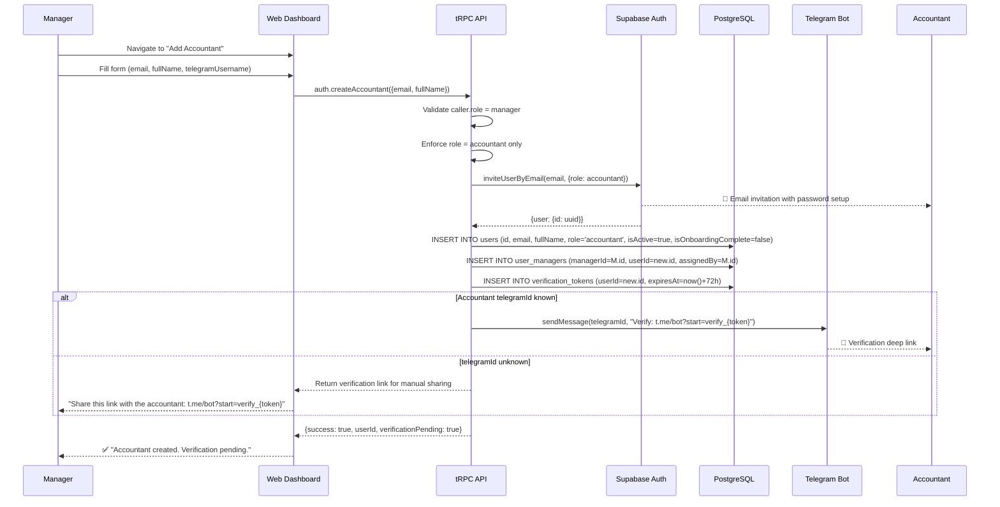

### 18.2 Registration Flow (Option B — Admin Creates)

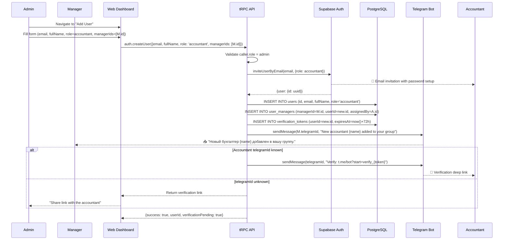

### 18.3 Telegram Verification Flow

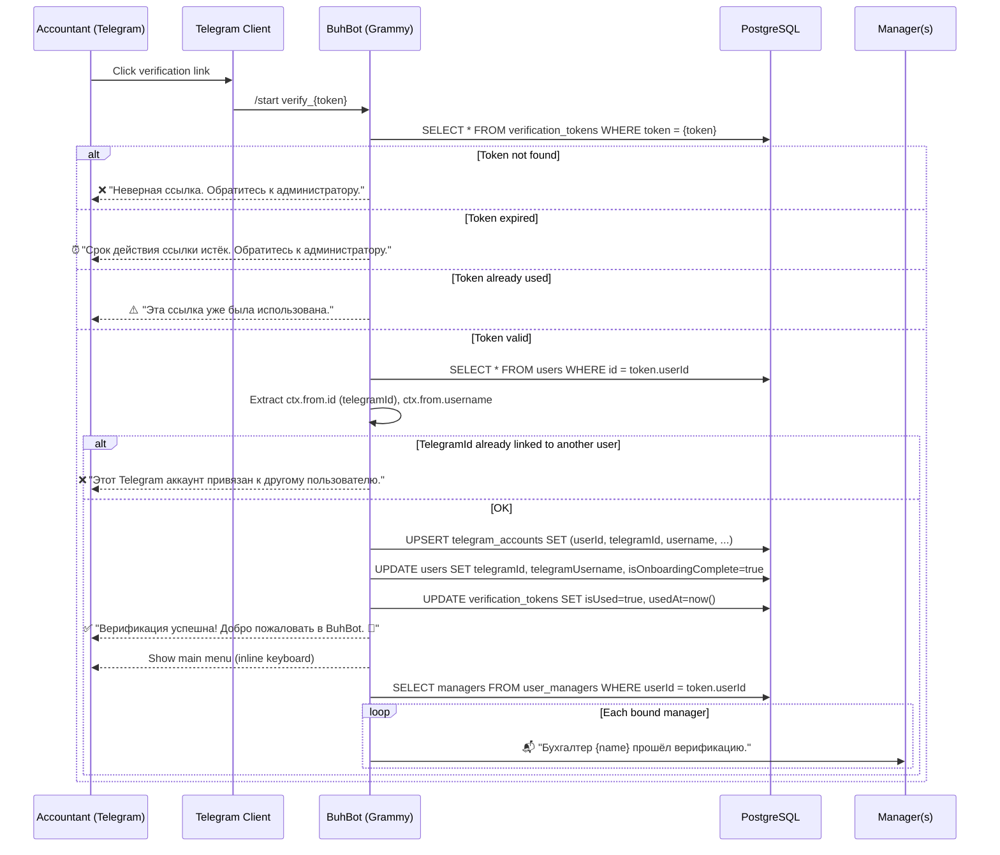

### 18.4 Reassignment Flow

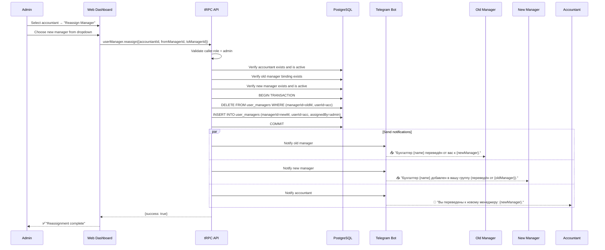

### 18.5 Deactivation Flow

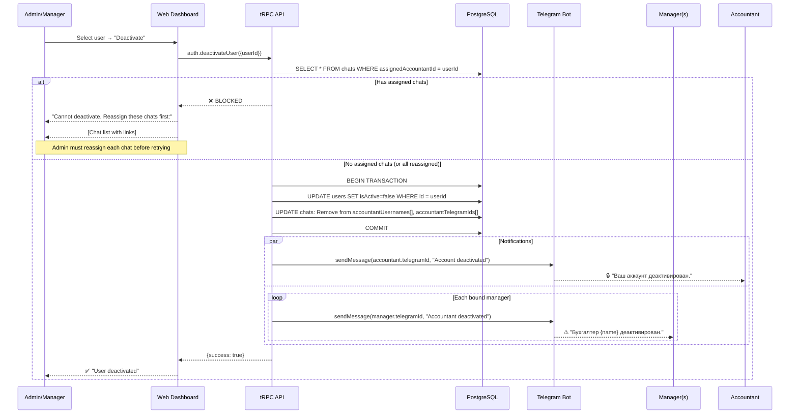

### 18.6 Manager Cascade Check

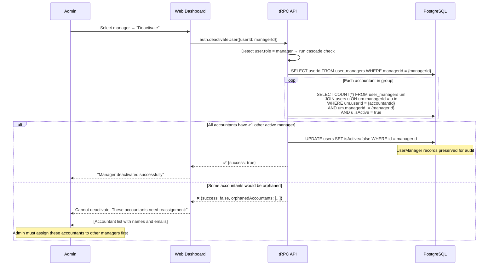

### 18.7 System Architecture Overview

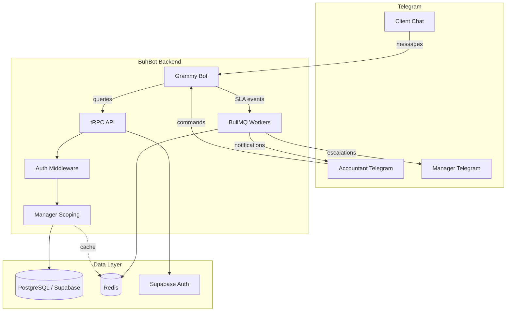

### 18.8 Role Hierarchy

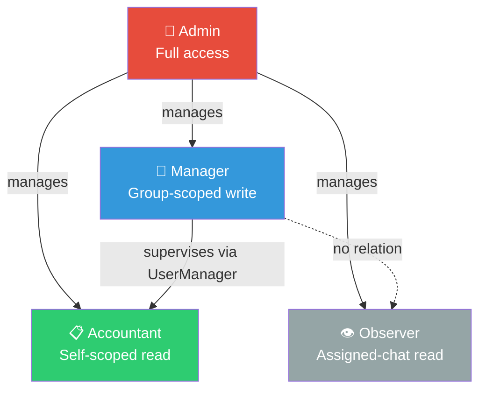

---

*End of document.*

**Document History**:

| Version | Date       | Author       | Changes              |
| ------- | ---------- | ------------ | -------------------- |
| 0.1.0   | 2026-03-04 | AI Dev Team  | Initial draft        |
