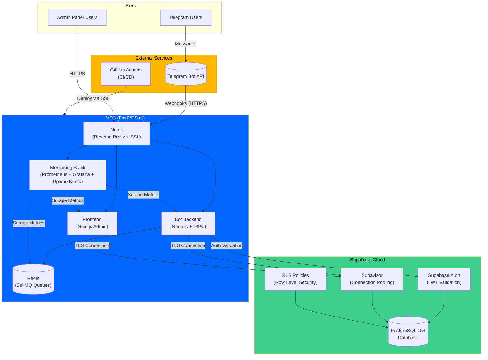
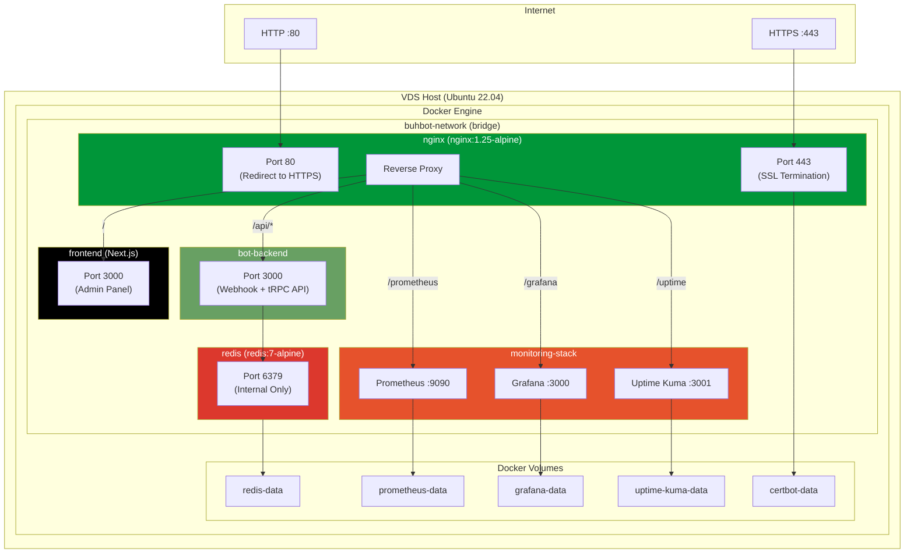
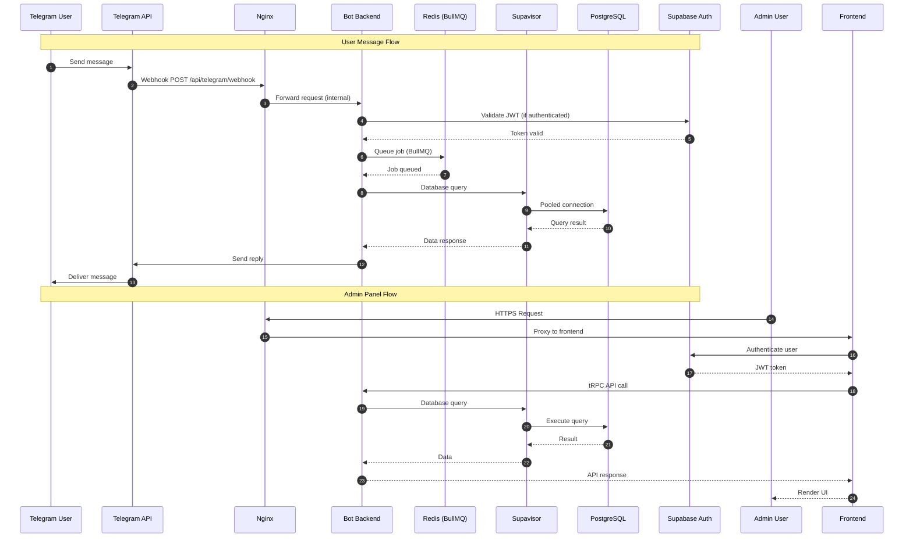
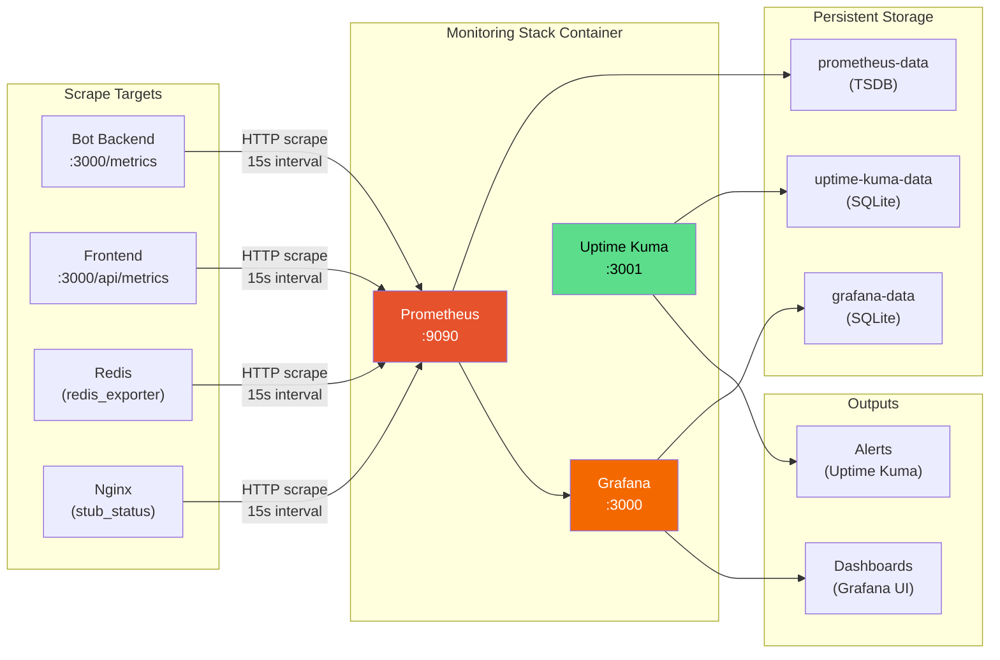

# BuhBot Infrastructure Architecture

**Version**: 1.0.0
**Last Updated**: 2025-11-22
**Target Environment**: Hybrid Supabase Cloud + VDS (FirstVDS.ru)

---

## Table of Contents

1. [Overview](#overview)
2. [Architecture Diagrams](#architecture-diagrams)
   - [High-Level System Architecture](#high-level-system-architecture)
   - [VDS Container Architecture](#vds-container-architecture)
   - [Data Flow Diagram](#data-flow-diagram)
   - [Monitoring Architecture](#monitoring-architecture)
3. [Component Descriptions](#component-descriptions)
4. [Network Configuration](#network-configuration)
5. [Data Flow Explanation](#data-flow-explanation)

---

## Overview

BuhBot uses a hybrid deployment model that combines:

- **Supabase Cloud**: Managed PostgreSQL database, authentication, and connection pooling
- **VDS (FirstVDS.ru)**: Application containers, caching, and monitoring infrastructure

This architecture ensures compliance with 152-FZ (Russian data protection law) while leveraging managed services for database operations.

---

## Architecture Diagrams

### High-Level System Architecture



### VDS Container Architecture



### Data Flow Diagram



### Monitoring Architecture



---

## Component Descriptions

### Supabase Cloud Components

| Component | Description | Purpose |
|-----------|-------------|---------|
| **PostgreSQL 15+** | Managed relational database | Primary data store for users, firms, conversations, messages |
| **Supavisor** | Connection pooler (PgBouncer replacement) | Manages database connections efficiently, supports IPv4/IPv6 |
| **Supabase Auth** | Authentication service | JWT token generation and validation, user management |
| **RLS Policies** | Row Level Security | Database-level security ensuring data isolation between firms |

### VDS Container Components

| Container | Image/Build | Port(s) | Purpose |
|-----------|-------------|---------|---------|
| **nginx** | `nginx:1.25-alpine` | 80, 443 | SSL termination, reverse proxy, rate limiting |
| **bot-backend** | Custom Node.js | 3000 | Telegram bot webhooks, tRPC API, business logic |
| **frontend** | Custom Next.js | 3000 (mapped to 3001) | Admin panel UI, dashboard, settings |
| **redis** | `redis:7-alpine` | 6379 (internal) | BullMQ job queues, session cache |
| **monitoring-stack** | Custom (supervisord) | 9090, 3000, 3001 | Prometheus metrics, Grafana dashboards, uptime monitoring |

### External Services

| Service | Purpose | Integration Method |
|---------|---------|-------------------|
| **Telegram Bot API** | Bot messaging platform | Webhooks via HTTPS |
| **GitHub Actions** | CI/CD pipeline | SSH deployment to VDS |

---

## Network Configuration

### Port Mapping

```
External                 Internal (Docker)
--------                 -----------------
:80   (HTTP)      -->    nginx:80
:443  (HTTPS)     -->    nginx:443
:3000 (Bot API)   -->    bot-backend:3000
:3001 (Frontend)  -->    frontend:3000
:9090 (Prometheus)-->    monitoring-stack:9090
:3002 (Grafana)   -->    monitoring-stack:3000
:3003 (Uptime)    -->    monitoring-stack:3001
:6379 (Redis)     -->    redis:6379 (internal only)
```

### Nginx Proxy Routes

| Route | Destination | Description |
|-------|-------------|-------------|
| `/api/*` | `bot-backend:3000` | tRPC API and webhook endpoints |
| `/` | `frontend:3000` | Admin panel |
| `/grafana` | `monitoring-stack:3000` | Grafana dashboards |
| `/uptime` | `monitoring-stack:3001` | Uptime Kuma status page |
| `/prometheus` | `monitoring-stack:9090` | Prometheus UI |

### Docker Network

- **Network Name**: `buhbot-network`
- **Driver**: bridge
- **DNS Resolution**: Container names resolve internally

---

## Data Flow Explanation

### 1. Telegram User Message Flow

1. **User sends message** to Telegram bot
2. **Telegram API** forwards webhook to `https://domain.com/api/telegram/webhook`
3. **Nginx** terminates SSL and proxies to `bot-backend:3000`
4. **Bot Backend** processes message:
   - Validates request authenticity (Telegram secret)
   - Queues job in Redis (BullMQ) for async processing
   - Queries Supabase via Supavisor for user/firm data
   - Generates response using business logic
5. **Bot Backend** sends reply via Telegram API
6. **User receives** bot response

### 2. Admin Panel Request Flow

1. **Admin user** navigates to `https://domain.com`
2. **Nginx** proxies to `frontend:3000`
3. **Frontend** authenticates via Supabase Auth
4. **Frontend** calls tRPC API (`/api/*`) for data
5. **Bot Backend** queries Supabase database
6. **Response** rendered in admin panel

### 3. Monitoring Data Flow

1. **Prometheus** scrapes metrics from all containers every 15 seconds:
   - `bot-backend:3000/metrics`
   - `frontend:3000/api/metrics`
   - Redis via redis-exporter
   - Nginx stub_status
2. **Prometheus** stores time-series data in `prometheus-data` volume
3. **Grafana** queries Prometheus and displays dashboards
4. **Uptime Kuma** performs HTTP checks and alerts on failures

### 4. Database Connection Flow

1. Application initiates connection to Supabase
2. **Supavisor** (connection pooler) manages connection pool
3. Queries execute on **PostgreSQL** with RLS policies applied
4. Results returned through pooler to application

---

## Resource Allocation Summary

| Service | Reserved (CPU/RAM) | Limit (CPU/RAM) | Priority |
|---------|-------------------|-----------------|----------|
| bot-backend | 1.5 cores / 1.5 GB | 2.0 cores / 2.0 GB | Highest |
| frontend | 0.5 cores / 512 MB | 1.0 cores / 1.0 GB | Medium |
| redis | 0.25 cores / 256 MB | 0.5 cores / 512 MB | Critical |
| monitoring-stack | 1.0 cores / 1.5 GB | 1.5 cores / 2.5 GB | Lowest |
| nginx | 0.25 cores / 128 MB | 0.5 cores / 256 MB | Lightweight |
| **TOTAL** | **3.5 cores / 3.88 GB** | **5.5 cores / 6.26 GB** | - |

**VDS Capacity**: 2-4 vCPU, 4-8 GB RAM

---

## ASCII Fallback Diagram

For environments without Mermaid rendering:

```
┌──────────────────────────────────────────────────────────────────────────────┐
│                              EXTERNAL SERVICES                                │
│                                                                              │
│    ┌────────────────┐                          ┌────────────────┐           │
│    │  Telegram API  │                          │ GitHub Actions │           │
│    │   (Webhooks)   │                          │    (CI/CD)     │           │
│    └───────┬────────┘                          └───────┬────────┘           │
│            │                                           │                     │
└────────────┼───────────────────────────────────────────┼─────────────────────┘
             │ HTTPS                                     │ SSH
             ▼                                           ▼
┌──────────────────────────────────────────────────────────────────────────────┐
│                           VDS (YANDEX CLOUD)                                 │
│                                                                              │
│    ┌─────────────────────────────────────────────────────────────────────┐  │
│    │                         NGINX REVERSE PROXY                          │  │
│    │              Port 80 (HTTP) → 443 (HTTPS + SSL)                     │  │
│    │         Rate Limiting: 100 req/min webhook, 10 req/s general        │  │
│    └────────┬───────────────────┬────────────────────┬───────────────────┘  │
│             │                   │                    │                       │
│             ▼                   ▼                    ▼                       │
│    ┌────────────────┐  ┌────────────────┐  ┌─────────────────────────────┐  │
│    │  BOT-BACKEND   │  │    FRONTEND    │  │     MONITORING STACK        │  │
│    │   Node.js 20   │  │    Next.js     │  │  ┌─────────────────────┐   │  │
│    │                │  │                │  │  │ Prometheus :9090    │   │  │
│    │  • Telegram    │  │  • Admin Panel │  │  │ Grafana    :3000    │   │  │
│    │  • tRPC API    │  │  • Dashboard   │  │  │ Uptime Kuma :3001   │   │  │
│    │  • BullMQ      │  │  • Settings    │  │  └─────────────────────┘   │  │
│    │                │  │                │  │                             │  │
│    │  Port: 3000    │  │  Port: 3001    │  │  Ports: 9090, 3002, 3003   │  │
│    └───────┬────────┘  └────────────────┘  └─────────────────────────────┘  │
│            │                                                                 │
│            ▼                                                                 │
│    ┌────────────────┐                                                        │
│    │     REDIS      │                                                        │
│    │  redis:7-alpine│                                                        │
│    │                │                                                        │
│    │  • BullMQ      │                                                        │
│    │  • Session     │                                                        │
│    │    Cache       │                                                        │
│    │                │                                                        │
│    │  Port: 6379    │                                                        │
│    │  (internal)    │                                                        │
│    └────────────────┘                                                        │
│                                                                              │
│    Docker Network: buhbot-network (bridge)                                   │
│    Volumes: redis-data, prometheus-data, grafana-data, uptime-kuma-data     │
└──────────────────────────────────────────────────────────────────────────────┘
             │
             │ TLS Connection (Port 5432/6543)
             ▼
┌──────────────────────────────────────────────────────────────────────────────┐
│                            SUPABASE CLOUD                                    │
│                                                                              │
│    ┌────────────────┐  ┌────────────────┐  ┌────────────────┐              │
│    │  PostgreSQL    │  │   Supavisor    │  │ Supabase Auth  │              │
│    │     15+        │  │  (Pooling)     │  │(JWT Validation)│              │
│    │                │  │                │  │                │              │
│    │  • Users       │  │  • PgBouncer   │  │  • Login       │              │
│    │  • Firms       │  │    compatible  │  │  • Signup      │              │
│    │  • Messages    │  │  • IPv4/IPv6   │  │  • Tokens      │              │
│    │  • Settings    │  │                │  │                │              │
│    └───────┬────────┘  └────────────────┘  └────────────────┘              │
│            │                                                                 │
│            ▼                                                                 │
│    ┌────────────────┐                                                        │
│    │  RLS Policies  │                                                        │
│    │                │                                                        │
│    │  • Firm        │                                                        │
│    │    isolation   │                                                        │
│    │  • User access │                                                        │
│    │    control     │                                                        │
│    └────────────────┘                                                        │
│                                                                              │
└──────────────────────────────────────────────────────────────────────────────┘
```

---

## Related Documentation

- [VDS Setup Guide](./vds-setup.md)
- [Monitoring Guide](./monitoring-guide.md)
- [Security Checklist](./security-checklist.md)
- [CI/CD Setup](./ci-cd-setup.md)
- [Disaster Recovery](./disaster-recovery.md)
