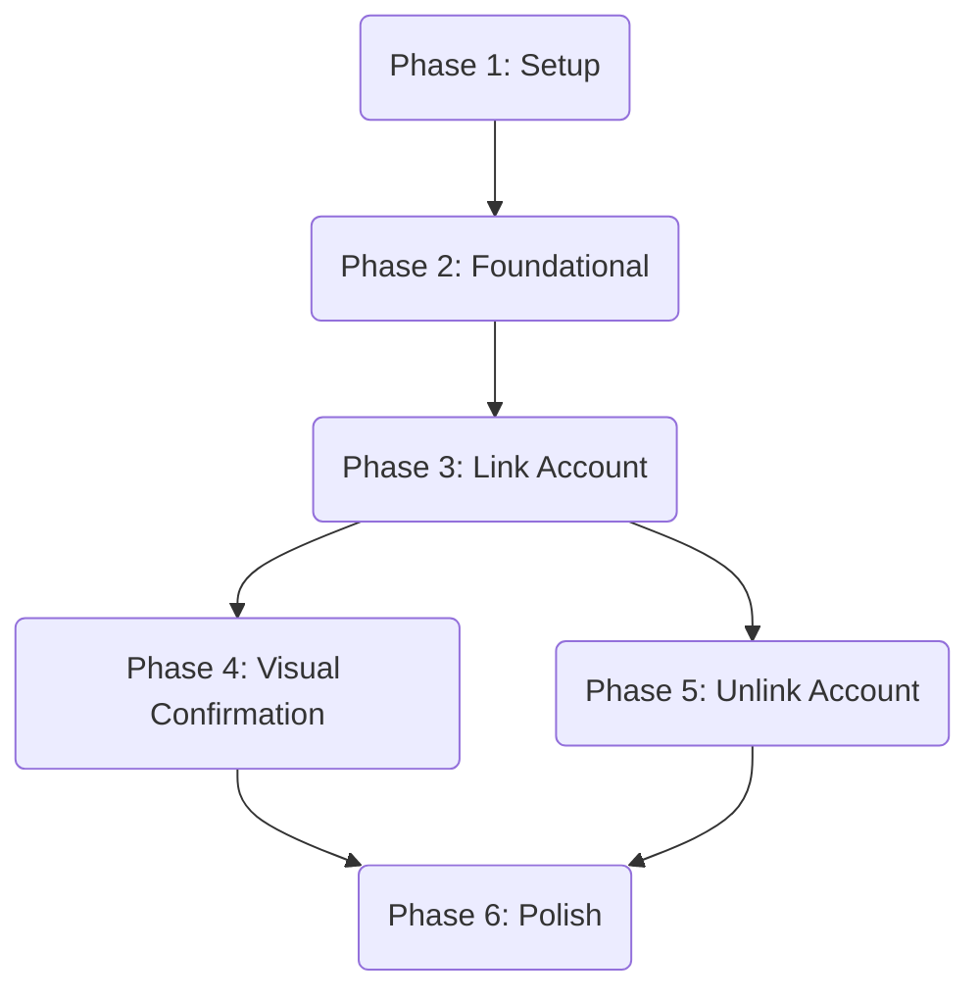

# Tasks: Telegram Login Integration

**Feature**: Telegram Login Integration
**Spec**: [specs/006-telegram-login/spec.md](../spec.md)
**Plan**: [specs/006-telegram-login/plan.md](../plan.md)

## Implementation Strategy

**MVP Approach**:

1.  **Setup & Foundation**: Database schema and basic verification logic.
2.  **User Story 1**: Implementation of the core linking flow. This delivers the primary value (secure linking).
3.  **User Story 3**: Visual confirmation (UX).
4.  **User Story 2**: Unlinking (Account management).
5.  **Polish**: Error handling and edge cases.

**Parallel Execution**:

- Backend and Frontend tasks within the same story can often run in parallel once the contract is defined.
- US3 (Visual) and US2 (Unlink) are independent of each other and can be done in parallel after US1.

---

## Phase 0: Planning

- [x] P001 Task analysis (identify required agent types and capabilities)
- [x] P002 Agent creation via meta-agent-v3 in single message, then ask restart
- [x] P003 Executor assignment (MAIN for trivial only, existing if 100% match, specific agents otherwise)
- [x] P004 Research resolution (simple: solve now, complex: create prompts)

---

## Phase 1: Setup

**Goal**: Initialize project structure and database schema.

- [x] T001 Verify backend dependencies (crypto, prisma) in `backend/package.json`
- [x] T002 Update `backend/prisma/schema.prisma` to include `TelegramAccount` model and relation to `User`
- [x] T003 Run `npm run prisma:migrate` (or `prisma db push` for dev) to apply schema changes
      → Artifacts: [telegram_accounts table](supabase migration via MCP)

---

## Phase 2: Foundational

**Goal**: Core logic for Telegram verification and widget wrapper.

- [x] T004 Create `TelegramService` in `backend/src/services/telegram.service.ts` (or similar) with `verifyHash` logic
- [x] T005 Create `TelegramLoginButton` component in `frontend/src/components/telegram/TelegramLoginButton.tsx`

---

## Phase 3: User Story 1 - Link Telegram Account

**Goal**: Users can securely link their Telegram account.
**Priority**: P1
**Independent Test**: User clicks "Login with Telegram", authorizes, and sees success.

- [x] T006 [US1] Backend: Define `linkTelegram` input validation schema in `backend/src/modules/user/user.schema.ts` (or trpc router)
- [x] T007 [P] [US1] Backend: Implement `linkTelegram` mutation in `backend/src/trpc/routers/user.ts` calling `TelegramService`
- [x] T008 [P] [US1] Frontend: Add `useLinkTelegram` mutation hook in `frontend/src/services/user.ts` (if using separate service file) or usage in component
      → Artifacts: [ProfileSettingsForm.tsx](frontend/src/components/settings/ProfileSettingsForm.tsx)
- [x] T009 [US1] Frontend: Integrate `TelegramLoginButton` into `frontend/src/app/(dashboard)/settings/page.tsx`
      → Artifacts: [ProfileSettingsForm.tsx](frontend/src/components/settings/ProfileSettingsForm.tsx)
- [x] T010 [US1] Frontend: Handle `onAuth` callback to trigger `linkTelegram` mutation and handle success/error
      → Artifacts: [ProfileSettingsForm.tsx](frontend/src/components/settings/ProfileSettingsForm.tsx)

---

## Phase 4: User Story 3 - Visual Confirmation

**Goal**: Users see their linked account details.
**Priority**: P2
**Independent Test**: Settings page shows avatar and username.

- [x] T011 [US3] Backend: Update `getProfile` (or `me`) query in `backend/src/trpc/routers/user.ts` to include `telegramAccount`
- [x] T012 [P] [US3] Frontend: Create `TelegramAccountCard` component in `frontend/src/components/telegram/TelegramAccountCard.tsx`
- [x] T013 [US3] Frontend: Update `frontend/src/app/(dashboard)/settings/page.tsx` to conditionally render Button vs Card based on profile data

---

## Phase 5: User Story 2 - Unlink Telegram Account

**Goal**: Users can disconnect their account.
**Priority**: P2
**Independent Test**: User clicks Disconnect, confirms, and button reappears.

- [x] T014 [US2] Backend: Implement `unlinkTelegram` mutation in `backend/src/trpc/routers/user.ts`
- [x] T015 [P] [US2] Frontend: Add "Disconnect" button to `TelegramAccountCard` component
- [x] T016 [US2] Frontend: Implement confirmation dialog for unlinking in `frontend/src/components/telegram/TelegramAccountCard.tsx`
- [x] T017 [US2] Frontend: connect disconnect action to `unlinkTelegram` mutation

---

## Phase 6: Polish & Edge Cases

**Goal**: Production readiness.

- [x] T018 Verify error messages are in Russian (FR-010) in backend responses and frontend toasts
- [x] T019 Ensure `TelegramLoginButton` is hidden if `NEXT_PUBLIC_BOT_NAME` is missing (FR-009)
- [x] T020 Verify 24h expiry logic in `TelegramService` (FR-004)
- [x] T021 Add audit logging for link/unlink operations (NFR-003) in `TelegramService`
- [x] T022 Add rate limiting on `linkTelegram` mutation (Security: prevent brute-force)
      → Artifacts: [rate-limiter.ts](backend/src/services/telegram/rate-limiter.ts), [user.ts](backend/src/api/trpc/routers/user.ts)
- [ ] T023 Test Telegram widget on mobile browsers (NFR-002): iOS Safari, Android Chrome

---

## Dependencies

