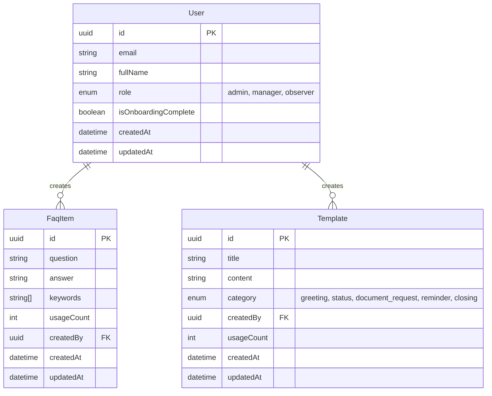

# Data Model: Admin Panel CRUD Pages

**Feature Branch**: `007-admin-crud-pages`

## Entity Relationship Diagram

## Schema Notes

- **User**: Existing model. `role` field is key for User Management page.
- **FaqItem**: Existing model. `keywords` is a string array (PostgreSQL `text[]`).
- **Template**: Existing model. `content` stores the message text with variables (e.g. `{{clientName}}`).

No database migrations are required for this feature.
