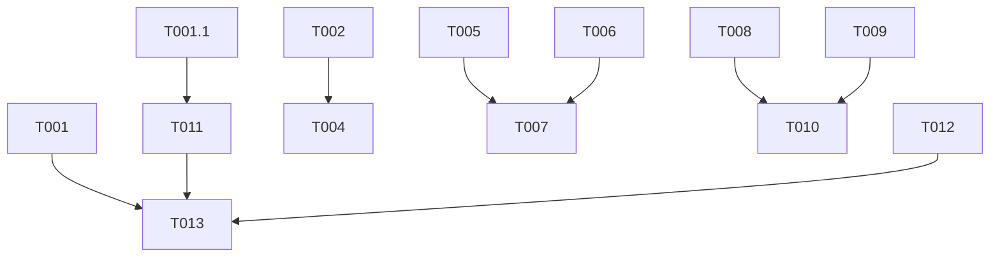

# Tasks: Admin Panel CRUD Pages

**Feature**: Admin Panel CRUD Pages & Polish
**Spec**: [specs/007-admin-crud-pages/spec.md](../spec.md)
**Plan**: [specs/007-admin-crud-pages/plan.md](../plan.md)

## Phase 0: Planning

- [x] P001 Task analysis
- [x] P002 Agent creation (using existing agents)
- [x] P003 Executor assignment

## Phase 1: Backend Updates

**Goal**: Ensure API supports all required operations.

- [x] T001 [P] Add `updateUserRole` mutation to `backend/src/api/trpc/routers/auth.ts` (Admin only) [EXECUTOR: api-builder]
- [x] T001.1 [P] Extend `listUsers` query to include `telegramId` field in output [EXECUTOR: api-builder]

## Phase 2: Navigation & Placeholders

**Goal**: Fix broken links and provide "Coming Soon" states.

- [x] T002 Create `ComingSoon` component in `frontend/src/components/common/ComingSoon.tsx` [EXECUTOR: nextjs-ui-designer]
- [x] T003 Update `frontend/src/components/layout/AdminLayout.tsx` sidebar links (`/clients` -> `/chats`) [EXECUTOR: fullstack-nextjs-specialist]
- [x] T004 Create placeholder pages for `/sla` and `/reports` using `ComingSoon` [EXECUTOR: fullstack-nextjs-specialist]
  - _Note:_ Full pages were implemented instead of placeholders.

## Phase 3: FAQ Management

**Goal**: Full CRUD for FAQs.

- [x] T005 Create `FaqList` component in `frontend/src/components/settings/faq/FaqList.tsx` (Table view) [EXECUTOR: nextjs-ui-designer]
- [x] T006 Create `FaqForm` component in `frontend/src/components/settings/faq/FaqForm.tsx` (Zod validation) [EXECUTOR: nextjs-ui-designer]
- [x] T007 Create page `frontend/src/app/settings/faq/page.tsx` and integrate list/form [EXECUTOR: fullstack-nextjs-specialist]

## Phase 4: Template Management

**Goal**: Full CRUD for Templates with variable helpers.

- [x] T008 Create `TemplateList` component in `frontend/src/components/settings/templates/TemplateList.tsx` [EXECUTOR: nextjs-ui-designer]
- [x] T009 Create `TemplateForm` component in `frontend/src/components/settings/templates/TemplateForm.tsx` (with variable chips) [EXECUTOR: nextjs-ui-designer]
- [x] T010 Create page `frontend/src/app/settings/templates/page.tsx` and integrate list/form [EXECUTOR: fullstack-nextjs-specialist]

## Phase 5: User Management

**Goal**: List users and manage roles.

- [x] T011 Create `UserList` component in `frontend/src/components/settings/users/UserList.tsx` [EXECUTOR: nextjs-ui-designer]
- [x] T012 Create `UserRoleDialog` component in `frontend/src/components/settings/users/UserRoleDialog.tsx` [EXECUTOR: nextjs-ui-designer]
- [x] T013 Create page `frontend/src/app/settings/users/page.tsx` and integrate list/dialog [EXECUTOR: fullstack-nextjs-specialist]

## Dependencies

## Implementation Notes

1. **Variable Chips (T009)**: Use standard DOM `selectionStart`/`selectionEnd` for cursor position. Insert variable at cursor using `setValue` from react-hook-form.
2. **Telegram Status (T011)**: Display icon/badge based on `telegramId !== null` from extended `listUsers` API.
3. **Search (T005, T011)**: Implement client-side filtering with `useMemo` + search input state.
